# DDIA ch. 5: Replication, every situation as a diagram

**What it's for:** quick revision of *Designing Data-Intensive Applications* (1st edition) chapter 5. There is one diagram for every figure (5-1 to 5-14) and for every situation the chapter walks through, in the chapter's order.

> **Source:** Martin Kleppmann, *Designing Data-Intensive Applications*, ch. 5 "Replication", pp. 151–198 of the book, read in the free official excerpt published by O'Reilly and ScyllaDB ([PDF](https://www.scylladb.com/wp-content/uploads/ScyllaDB-Designing-Data-Intensive-Applications.pdf)). Every name, number and example below is from the chapter text. Where the book has a figure, the diagram redraws it from the text that describes it, and the heading gives the figure number.

**Contents**
1. [The chapter on one page](#1-the-chapter-on-one-page)
2. [Leaders and followers](#2-leaders-and-followers)
3. [Synchronous vs asynchronous](#3-synchronous-vs-asynchronous)
4. [Setting up new followers](#4-setting-up-new-followers)
5. [Handling node outages](#5-handling-node-outages)
6. [Implementation of replication logs](#6-implementation-of-replication-logs)
7. [Problems with replication lag](#7-problems-with-replication-lag)
8. [Multi-leader replication](#8-multi-leader-replication)
9. [Handling write conflicts](#9-handling-write-conflicts)
10. [Multi-leader topologies](#10-multi-leader-topologies)
11. [Leaderless replication](#11-leaderless-replication)
12. [Quorums and their limits](#12-quorums-and-their-limits)
13. [Sloppy quorums, hinted handoff, multi-datacenter](#13-sloppy-quorums-hinted-handoff-multi-datacenter)
14. [Detecting concurrent writes](#14-detecting-concurrent-writes)
15. [Summary](#15-summary)

---

## 1. The chapter on one page

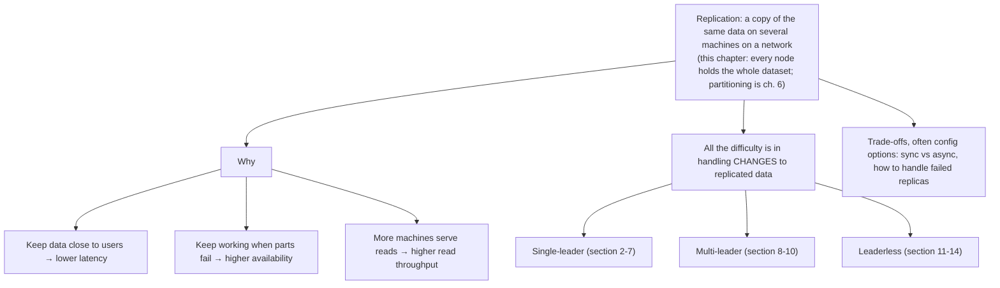
```mermaid
flowchart TB
    R["Replication: a copy of the same data on several machines on a network<br/>(this chapter: every node holds the whole dataset; partitioning is ch. 6)"] --> WHY["Why"]
    WHY --> W1["Keep data close to users → lower latency"]
    WHY --> W2["Keep working when parts fail → higher availability"]
    WHY --> W3["More machines serve reads → higher read throughput"]
    R --> HARD["All the difficulty is in handling CHANGES to replicated data"]
    HARD --> SL["Single-leader (section 2-7)"]
    HARD --> ML["Multi-leader (section 8-10)"]
    HARD --> LL["Leaderless (section 11-14)"]
    R --> TO["Trade-offs, often config options: sync vs async, how to handle failed replicas"]
```

---

## 2. Leaders and followers

**Figure 5-1: leader-based (master–slave) replication.** Also called active/passive or master–slave.

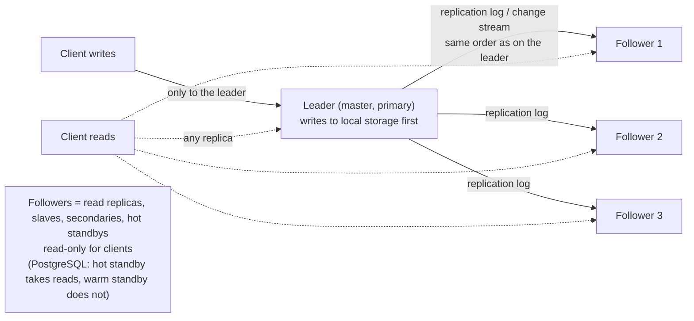
```mermaid
flowchart LR
    CW["Client writes"] -->|"only to the leader"| L["Leader (master, primary)<br/>writes to local storage first"]
    L -->|"replication log / change stream<br/>same order as on the leader"| F1["Follower 1"]
    L -->|"replication log"| F2["Follower 2"]
    L -->|"replication log"| F3["Follower 3"]
    CR["Client reads"] -.->|"any replica"| L
    CR -.-> F1
    CR -.-> F2
    CR -.-> F3
    NOTE["Followers = read replicas, slaves, secondaries, hot standbys<br/>read-only for clients<br/>(PostgreSQL: hot standby takes reads, warm standby does not)"]
```

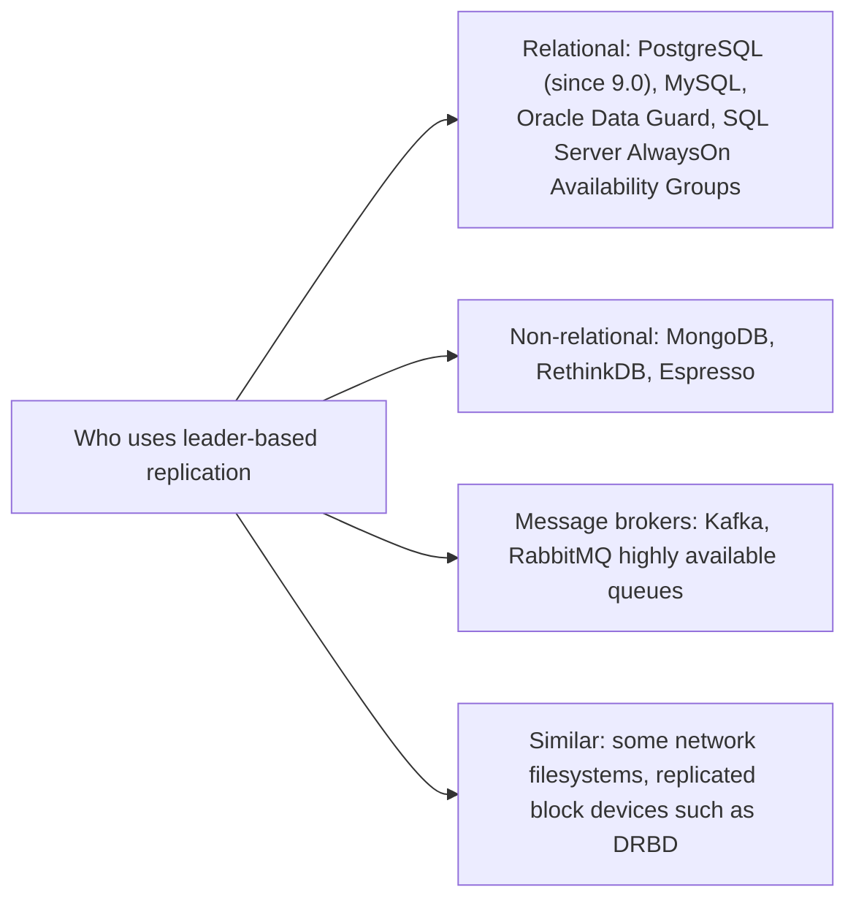
```mermaid
flowchart LR
    U["Who uses leader-based replication"] --> REL["Relational: PostgreSQL (since 9.0), MySQL,<br/>Oracle Data Guard, SQL Server AlwaysOn Availability Groups"]
    U --> NR["Non-relational: MongoDB, RethinkDB, Espresso"]
    U --> MQ["Message brokers: Kafka, RabbitMQ highly available queues"]
    U --> FS["Similar: some network filesystems, replicated block devices such as DRBD"]
```

---

## 3. Synchronous vs asynchronous

**Figure 5-2: one synchronous and one asynchronous follower.** The user updates their profile image.

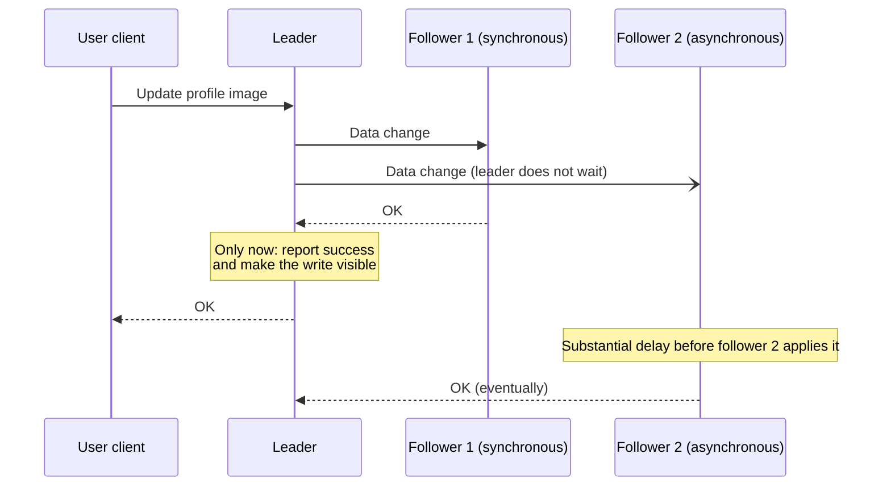
```mermaid
sequenceDiagram
    participant U as User client
    participant L as Leader
    participant F1 as Follower 1 (synchronous)
    participant F2 as Follower 2 (asynchronous)
    U->>L: Update profile image
    L->>F1: Data change
    L-)F2: Data change (leader does not wait)
    F1-->>L: OK
    Note over L: Only now: report success<br/>and make the write visible
    L-->>U: OK
    Note over F2: Substantial delay before follower 2 applies it
    F2-->>L: OK (eventually)
```

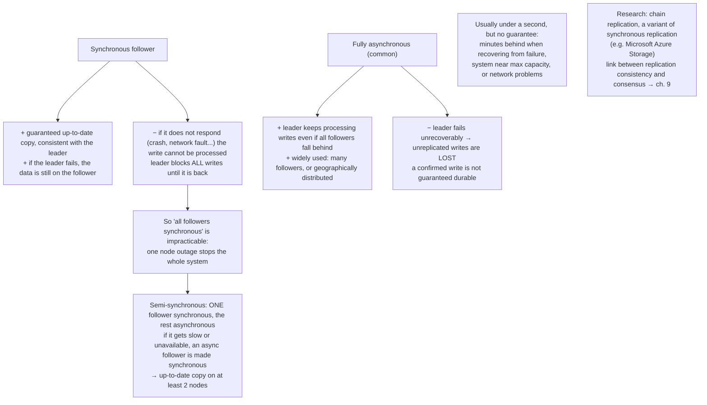
```mermaid
flowchart TB
    S["Synchronous follower"] --> SP["+ guaranteed up-to-date copy, consistent with the leader<br/>+ if the leader fails, the data is still on the follower"]
    S --> SM["− if it does not respond (crash, network fault...) the write cannot be processed<br/>leader blocks ALL writes until it is back"]
    SM --> ALL["So 'all followers synchronous' is impracticable:<br/>one node outage stops the whole system"]
    ALL --> SEMI["Semi-synchronous: ONE follower synchronous, the rest asynchronous<br/>if it gets slow or unavailable, an async follower is made synchronous<br/>→ up-to-date copy on at least 2 nodes"]
    A["Fully asynchronous (common)"] --> AP["+ leader keeps processing writes even if all followers fall behind<br/>+ widely used: many followers, or geographically distributed"]
    A --> AM["− leader fails unrecoverably → unreplicated writes are LOST<br/>a confirmed write is not guaranteed durable"]
    LAG["Usually under a second, but no guarantee:<br/>minutes behind when recovering from failure,<br/>system near max capacity, or network problems"]
    RES["Research: chain replication, a variant of synchronous replication<br/>(e.g. Microsoft Azure Storage)<br/>link between replication consistency and consensus → ch. 9"]
```

---

## 4. Setting up new followers

Plain file copy is not enough (the data is always changing), and locking the database goes against high availability.

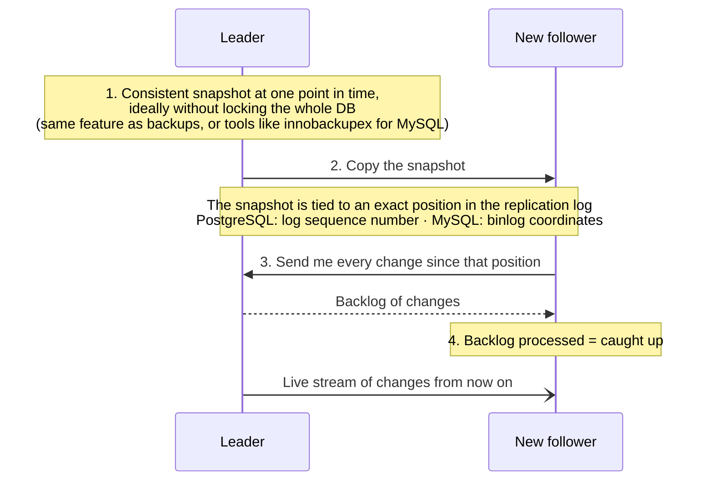
```mermaid
sequenceDiagram
    participant L as Leader
    participant N as New follower
    Note over L: 1. Consistent snapshot at one point in time,<br/>ideally without locking the whole DB<br/>(same feature as backups, or tools like innobackupex for MySQL)
    L->>N: 2. Copy the snapshot
    Note over L,N: The snapshot is tied to an exact position in the replication log<br/>PostgreSQL: log sequence number · MySQL: binlog coordinates
    N->>L: 3. Send me every change since that position
    L-->>N: Backlog of changes
    Note over N: 4. Backlog processed = caught up
    L-)N: Live stream of changes from now on
```

---

## 5. Handling node outages

Goal: keep the whole system running despite single-node failures (crash, or planned maintenance like a kernel patch reboot), with as little impact as possible.

**Follower failure: catch-up recovery**

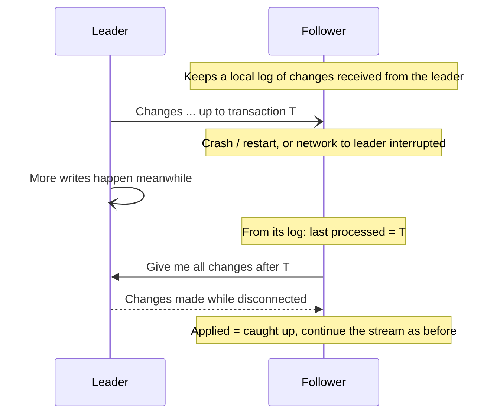
```mermaid
sequenceDiagram
    participant L as Leader
    participant F as Follower
    Note over F: Keeps a local log of changes received from the leader
    L-)F: Changes ... up to transaction T
    Note over F: Crash / restart, or network to leader interrupted
    L-)L: More writes happen meanwhile
    Note over F: From its log: last processed = T
    F->>L: Give me all changes after T
    L-->>F: Changes made while disconnected
    Note over F: Applied = caught up, continue the stream as before
```

**Leader failure: failover** (manual by an administrator, or automatic)

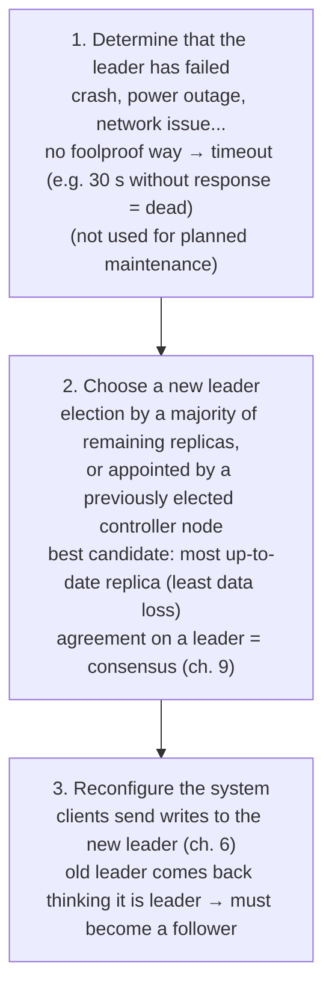
```mermaid
flowchart TB
    D["1. Determine that the leader has failed<br/>crash, power outage, network issue...<br/>no foolproof way → timeout (e.g. 30 s without response = dead)<br/>(not used for planned maintenance)"] --> C["2. Choose a new leader<br/>election by a majority of remaining replicas,<br/>or appointed by a previously elected controller node<br/>best candidate: most up-to-date replica (least data loss)<br/>agreement on a leader = consensus (ch. 9)"]
    C --> RC["3. Reconfigure the system<br/>clients send writes to the new leader (ch. 6)<br/>old leader comes back thinking it is leader → must become a follower"]
```

What can go wrong in failover:

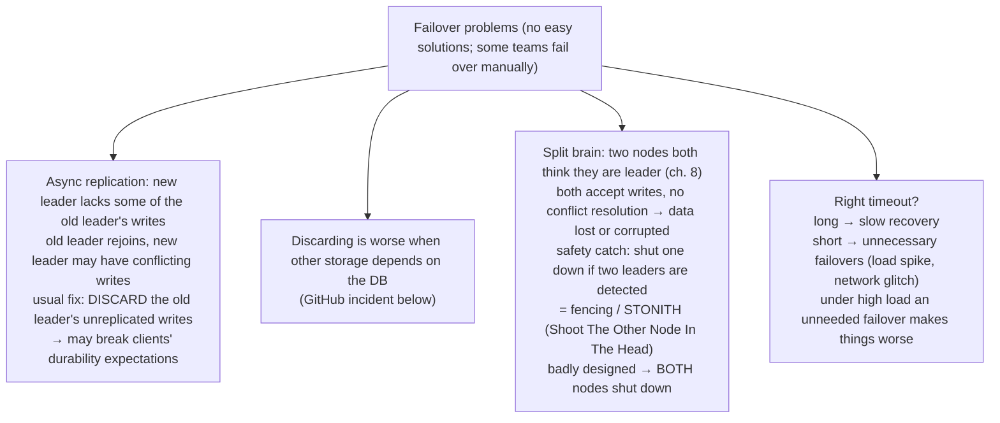
```mermaid
flowchart TB
    P["Failover problems (no easy solutions; some teams fail over manually)"] --> P1["Async replication: new leader lacks some of the old leader's writes<br/>old leader rejoins, new leader may have conflicting writes<br/>usual fix: DISCARD the old leader's unreplicated writes<br/>→ may break clients' durability expectations"]
    P --> P2["Discarding is worse when other storage depends on the DB<br/>(GitHub incident below)"]
    P --> P3["Split brain: two nodes both think they are leader (ch. 8)<br/>both accept writes, no conflict resolution → data lost or corrupted<br/>safety catch: shut one down if two leaders are detected<br/>= fencing / STONITH (Shoot The Other Node In The Head)<br/>badly designed → BOTH nodes shut down"]
    P --> P4["Right timeout?<br/>long → slow recovery<br/>short → unnecessary failovers (load spike, network glitch)<br/>under high load an unneeded failover makes things worse"]
```

The GitHub incident (an out-of-date MySQL follower promoted to leader):

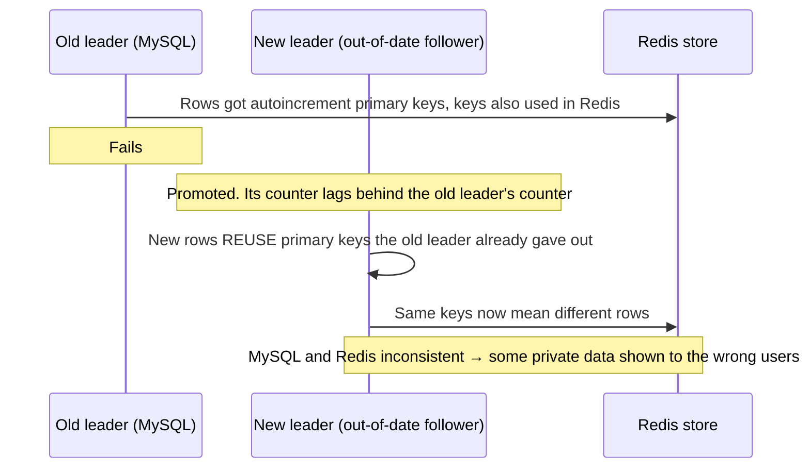
```mermaid
sequenceDiagram
    participant OL as Old leader (MySQL)
    participant NL as New leader (out-of-date follower)
    participant R as Redis store
    OL->>R: Rows got autoincrement primary keys, keys also used in Redis
    Note over OL: Fails
    Note over NL: Promoted. Its counter lags behind the old leader's counter
    NL->>NL: New rows REUSE primary keys the old leader already gave out
    NL->>R: Same keys now mean different rows
    Note over NL,R: MySQL and Redis inconsistent → some private data shown to the wrong users
```

---

## 6. Implementation of replication logs

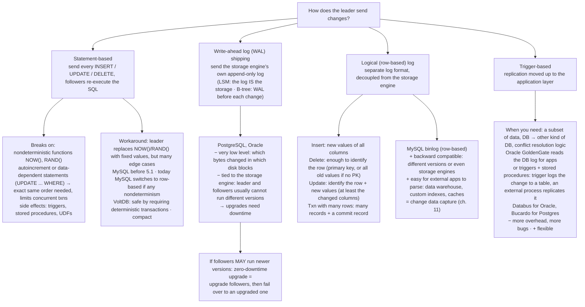
```mermaid
flowchart TB
    RL["How does the leader send changes?"] --> SB["Statement-based<br/>send every INSERT / UPDATE / DELETE, followers re-execute the SQL"]
    RL --> WAL["Write-ahead log (WAL) shipping<br/>send the storage engine's own append-only log<br/>(LSM: the log IS the storage · B-tree: WAL before each change)"]
    RL --> LOG["Logical (row-based) log<br/>separate log format, decoupled from the storage engine"]
    RL --> TRG["Trigger-based<br/>replication moved up to the application layer"]
    SB --> SB1["Breaks on: nondeterministic functions NOW(), RAND()<br/>autoincrement or data-dependent statements (UPDATE ... WHERE) → exact same order needed, limits concurrent txns<br/>side effects: triggers, stored procedures, UDFs"]
    SB --> SB2["Workaround: leader replaces NOW()/RAND() with fixed values, but many edge cases<br/>MySQL before 5.1 · today MySQL switches to row-based if any nondeterminism<br/>VoltDB: safe by requiring deterministic transactions · compact"]
    WAL --> W1["PostgreSQL, Oracle<br/>− very low level: which bytes changed in which disk blocks<br/>− tied to the storage engine: leader and followers usually cannot run different versions<br/>→ upgrades need downtime"]
    W1 --> W2["If followers MAY run newer versions: zero-downtime upgrade =<br/>upgrade followers, then fail over to an upgraded one"]
    LOG --> L1["Insert: new values of all columns<br/>Delete: enough to identify the row (primary key, or all old values if no PK)<br/>Update: identify the row + new values (at least the changed columns)<br/>Txn with many rows: many records + a commit record"]
    LOG --> L2["MySQL binlog (row-based)<br/>+ backward compatible: different versions or even storage engines<br/>+ easy for external apps to parse: data warehouse, custom indexes, caches<br/>= change data capture (ch. 11)"]
    TRG --> T1["When you need: a subset of data, DB → other kind of DB, conflict resolution logic<br/>Oracle GoldenGate reads the DB log for apps<br/>or triggers + stored procedures: trigger logs the change to a table, an external process replicates it<br/>Databus for Oracle, Bucardo for Postgres<br/>− more overhead, more bugs · + flexible"]
```

---

## 7. Problems with replication lag

Read-scaling: mostly reads, few writes → many followers, spread reads over them. Only realistic with **asynchronous** replication (fully synchronous to many nodes would be very unreliable).

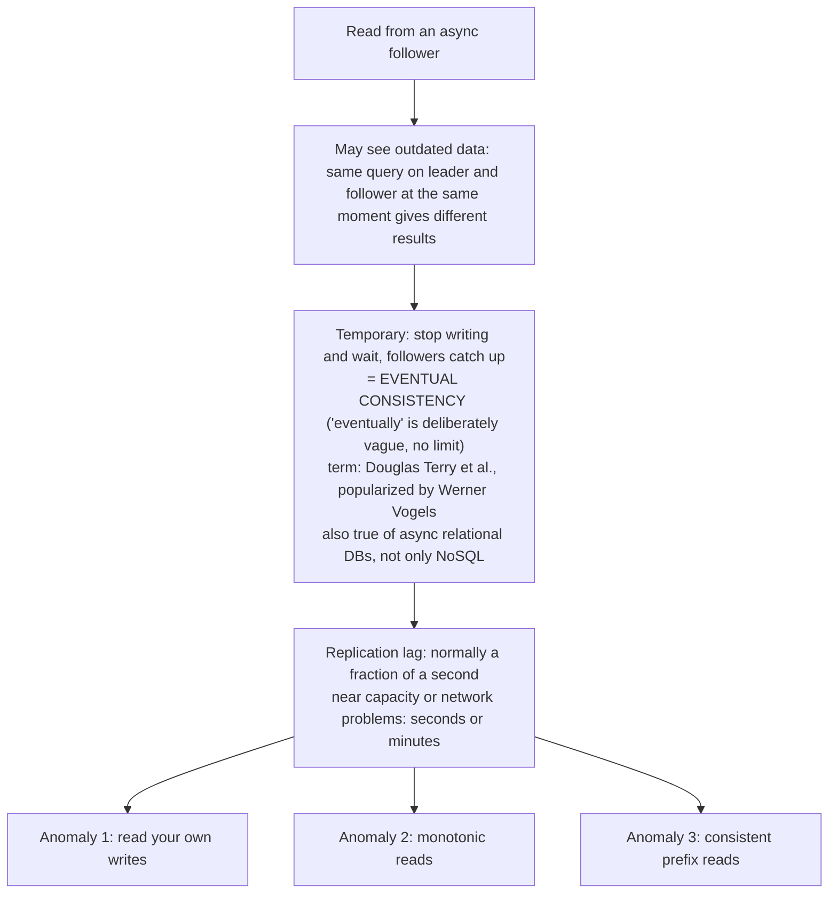
```mermaid
flowchart TB
    RS["Read from an async follower"] --> STALE["May see outdated data: same query on leader and follower at the same moment gives different results"]
    STALE --> EC["Temporary: stop writing and wait, followers catch up<br/>= EVENTUAL CONSISTENCY ('eventually' is deliberately vague, no limit)<br/>term: Douglas Terry et al., popularized by Werner Vogels<br/>also true of async relational DBs, not only NoSQL"]
    EC --> LAGSZ["Replication lag: normally a fraction of a second<br/>near capacity or network problems: seconds or minutes"]
    LAGSZ --> A1["Anomaly 1: read your own writes"]
    LAGSZ --> A2["Anomaly 2: monotonic reads"]
    LAGSZ --> A3["Anomaly 3: consistent prefix reads"]
```

**Figure 5-3: a user writes, then reads from a stale replica.**

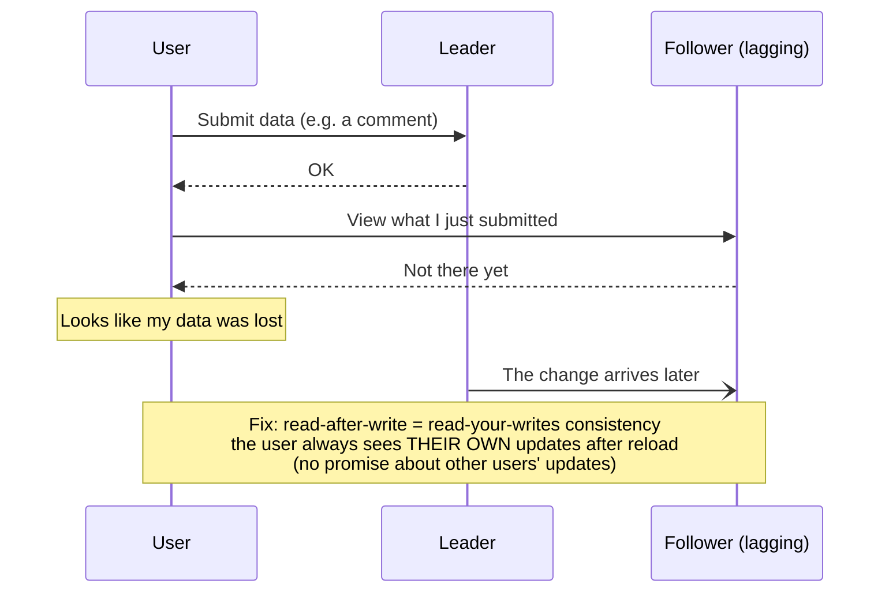
```mermaid
sequenceDiagram
    participant U as User
    participant L as Leader
    participant F as Follower (lagging)
    U->>L: Submit data (e.g. a comment)
    L-->>U: OK
    U->>F: View what I just submitted
    F-->>U: Not there yet
    Note over U: Looks like my data was lost
    L-)F: The change arrives later
    Note over U,F: Fix: read-after-write = read-your-writes consistency<br/>the user always sees THEIR OWN updates after reload<br/>(no promise about other users' updates)
```

How to implement read-after-write with leader-based replication:

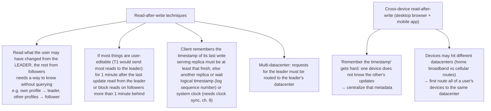
```mermaid
flowchart TB
    RYW["Read-after-write techniques"] --> T1["Read what the user may have changed from the LEADER, the rest from followers<br/>needs a way to know without querying<br/>e.g. own profile → leader, other profiles → follower"]
    RYW --> T2["If most things are user-editable (T1 would send most reads to the leader):<br/>for 1 minute after the last update read from the leader<br/>or block reads on followers more than 1 minute behind"]
    RYW --> T3["Client remembers the timestamp of its last write<br/>serving replica must be at least that fresh, else another replica or wait<br/>logical timestamp (log sequence number) or system clock (needs clock sync, ch. 8)"]
    RYW --> T4["Multi-datacenter: requests for the leader must be routed to the leader's datacenter"]
    XD["Cross-device read-after-write (desktop browser + mobile app)"] --> X1["'Remember the timestamp' gets hard: one device does not know the other's updates<br/>→ centralize that metadata"]
    XD --> X2["Devices may hit different datacenters (home broadband vs cellular routes)<br/>→ first route all of a user's devices to the same datacenter"]
```

**Figure 5-4: time goes backward.** User 2345 runs the same query twice.

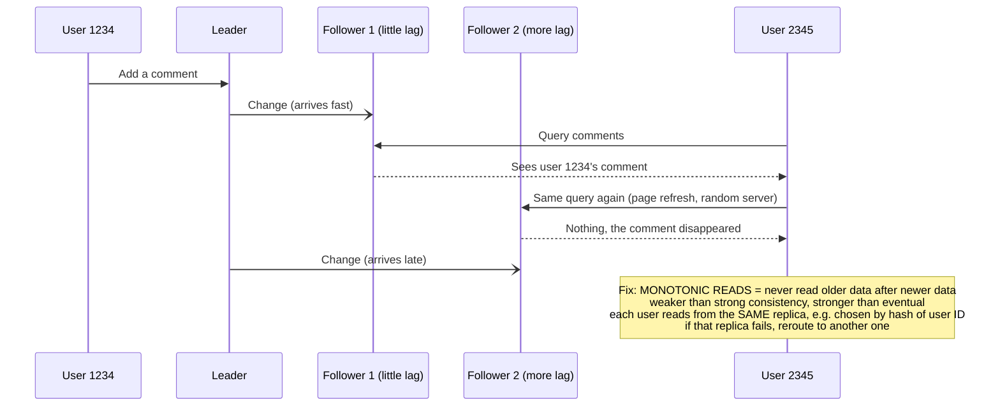
```mermaid
sequenceDiagram
    participant U1 as User 1234
    participant L as Leader
    participant F1 as Follower 1 (little lag)
    participant F2 as Follower 2 (more lag)
    participant U2 as User 2345
    U1->>L: Add a comment
    L-)F1: Change (arrives fast)
    U2->>F1: Query comments
    F1-->>U2: Sees user 1234's comment
    U2->>F2: Same query again (page refresh, random server)
    F2-->>U2: Nothing, the comment disappeared
    L-)F2: Change (arrives late)
    Note over U2: Fix: MONOTONIC READS = never read older data after newer data<br/>weaker than strong consistency, stronger than eventual<br/>each user reads from the SAME replica, e.g. chosen by hash of user ID<br/>if that replica fails, reroute to another one
```

**Figure 5-5: the answer before the question.** Two partitions replicate at different speeds.

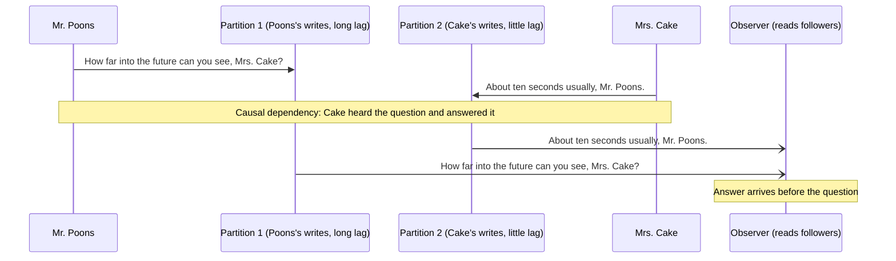
```mermaid
sequenceDiagram
    participant P as Mr. Poons
    participant PA as Partition 1 (Poons's writes, long lag)
    participant PB as Partition 2 (Cake's writes, little lag)
    participant C as Mrs. Cake
    participant O as Observer (reads followers)
    P->>PA: How far into the future can you see, Mrs. Cake?
    C->>PB: About ten seconds usually, Mr. Poons.
    Note over P,C: Causal dependency: Cake heard the question and answered it
    PB-)O: About ten seconds usually, Mr. Poons.
    PA-)O: How far into the future can you see, Mrs. Cake?
    Note over O: Answer arrives before the question
```

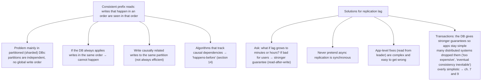
```mermaid
flowchart TB
    CP["Consistent prefix reads: writes that happen in an order are seen in that order"] --> WHY["Problem mainly in partitioned (sharded) DBs:<br/>partitions are independent, no global write order"]
    CP --> S1["If the DB always applies writes in the same order → cannot happen"]
    CP --> S2["Write causally related writes to the same partition (not always efficient)"]
    CP --> S3["Algorithms that track causal dependencies → 'happens-before' (section 14)"]
    SOL["Solutions for replication lag"] --> Q["Ask: what if lag grows to minutes or hours? If bad for users → stronger guarantee (read-after-write)"]
    SOL --> NOP["Never pretend async replication is synchronous"]
    SOL --> APP["App-level fixes (read from leader) are complex and easy to get wrong"]
    SOL --> TXN["Transactions: the DB gives stronger guarantees so apps stay simple<br/>many distributed systems dropped them ('too expensive', 'eventual consistency inevitable')<br/>overly simplistic → ch. 7 and 9"]
```

---

## 8. Multi-leader replication

Single-leader's downside: one leader, and every write goes through it. Multi-leader (master–master, active/active): several nodes accept writes, and each leader is also a follower of the others. It rarely makes sense inside one datacenter.

**Figure 5-6: multi-leader replication across datacenters.**

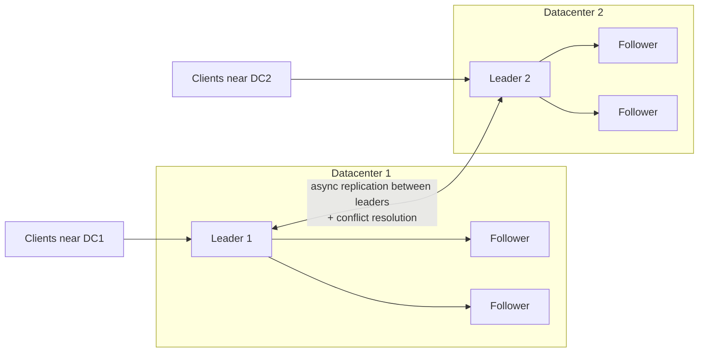
```mermaid
flowchart LR
    subgraph DC1["Datacenter 1"]
        L1["Leader 1"] --> F1a["Follower"]
        L1 --> F1b["Follower"]
    end
    subgraph DC2["Datacenter 2"]
        L2["Leader 2"] --> F2a["Follower"]
        L2 --> F2b["Follower"]
    end
    L1 <-->|"async replication between leaders<br/>+ conflict resolution"| L2
    C1["Clients near DC1"] --> L1
    C2["Clients near DC2"] --> L2
```

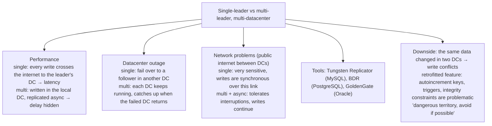
```mermaid
flowchart TB
    CMP["Single-leader vs multi-leader, multi-datacenter"] --> PERF["Performance<br/>single: every write crosses the internet to the leader's DC → latency<br/>multi: written in the local DC, replicated async → delay hidden"]
    CMP --> OUT["Datacenter outage<br/>single: fail over to a follower in another DC<br/>multi: each DC keeps running, catches up when the failed DC returns"]
    CMP --> NET["Network problems (public internet between DCs)<br/>single: very sensitive, writes are synchronous over this link<br/>multi + async: tolerates interruptions, writes continue"]
    CMP --> TOOLS["Tools: Tungsten Replicator (MySQL), BDR (PostgreSQL), GoldenGate (Oracle)"]
    CMP --> DOWN["Downside: the same data changed in two DCs → write conflicts<br/>retrofitted feature: autoincrement keys, triggers, integrity constraints are problematic<br/>'dangerous territory, avoid if possible'"]
```

Other use cases:

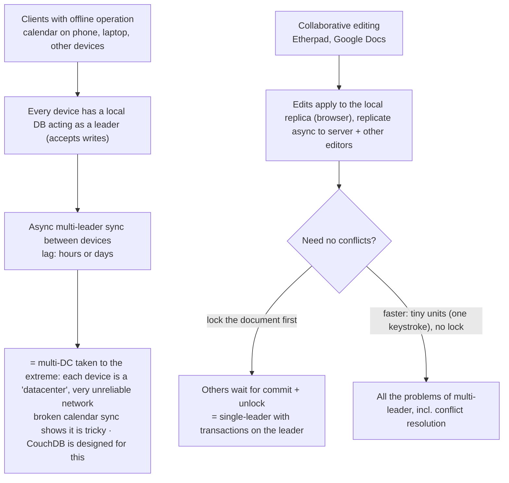
```mermaid
flowchart TB
    OFF["Clients with offline operation<br/>calendar on phone, laptop, other devices"] --> O1["Every device has a local DB acting as a leader (accepts writes)"]
    O1 --> O2["Async multi-leader sync between devices<br/>lag: hours or days"]
    O2 --> O3["= multi-DC taken to the extreme: each device is a 'datacenter', very unreliable network<br/>broken calendar sync shows it is tricky · CouchDB is designed for this"]
    COL["Collaborative editing<br/>Etherpad, Google Docs"] --> C1["Edits apply to the local replica (browser), replicate async to server + other editors"]
    C1 --> C2{"Need no conflicts?"}
    C2 -->|"lock the document first"| C3["Others wait for commit + unlock<br/>= single-leader with transactions on the leader"]
    C2 -->|"faster: tiny units (one keystroke), no lock"| C4["All the problems of multi-leader, incl. conflict resolution"]
```

---

## 9. Handling write conflicts

**Figure 5-7: two leaders update the same record at the same time.** A wiki page.

```mermaid
sequenceDiagram
    participant U1 as User 1
    participant L1 as Leader 1
    participant L2 as Leader 2
    participant U2 as User 2
    U1->>L1: Title A → B
    L1-->>U1: OK
    U2->>L2: Title A → C
    L2-->>U2: OK
    L1-)L2: Change: title A → B
    L2-)L1: Change: title A → C
    Note over L1,L2: CONFLICT detected asynchronously<br/>(cannot happen with a single leader)
```

```mermaid
flowchart TB
    DET["Detection"] --> SYNC["Single leader: 2nd writer blocks or aborts and retries"]
    DET --> ASYNC["Multi-leader: both writes succeed, conflict found later<br/>too late to ask the user"]
    DET --> SYNCD["Synchronous detection (wait for all replicas) loses the point of multi-leader<br/>→ might as well use single-leader"]
    AV["Conflict avoidance (simplest, often recommended)"] --> AV1["All writes for one record go through the same leader<br/>e.g. each user has a 'home' datacenter (by geography) → single-leader per user"]
    AV --> AV2["Breaks down when the leader for a record changes:<br/>a DC failed and traffic is rerouted, or the user moved"]
    CONV["Converge to a consistent state (all replicas reach the same final value)<br/>(leader 1 saw B then C, leader 2 saw C then B: neither is 'more correct'<br/>applying in arrival order → C at leader 1, B at leader 2: not acceptable)"] --> CV1["Unique ID per write (timestamp, random number, UUID, hash of key+value)<br/>highest ID wins; with timestamps = LAST WRITE WINS (LWW)<br/>popular, dangerously prone to data loss"]
    CONV --> CV2["Unique ID per replica: higher-numbered replica wins → data loss too"]
    CONV --> CV3["Merge the values, e.g. sort + concatenate → 'B/C'"]
    CONV --> CV4["Keep the conflict in an explicit data structure, resolve later in app code (maybe ask the user)"]
```

```mermaid
flowchart TB
    CUS["Custom conflict resolution logic (app code)"] --> ONW["On write: DB detects a conflict in the replicated log → calls a handler<br/>e.g. Bucardo: a snippet of Perl<br/>runs in the background, fast, cannot prompt a user"]
    CUS --> ONR["On read: all conflicting writes are stored<br/>next read returns all versions → app/user resolves, writes the result back<br/>e.g. CouchDB"]
    CUS --> GRAN["Usually per row/document, not per transaction:<br/>each write in an atomic txn is resolved separately"]
    AUTO["Automatic conflict resolution (research)"] --> AMZ["Warning: Amazon shopping cart handler kept added items but not removals<br/>→ removed items reappeared"]
    AUTO --> CRDT["CRDTs: sets, maps, ordered lists, counters that merge sensibly<br/>some in Riak 2.0 · two-way merge"]
    AUTO --> MPD["Mergeable persistent data structures: track history like Git<br/>three-way merge"]
    AUTO --> OT["Operational transformation: behind Etherpad and Google Docs<br/>made for ordered lists (characters of a text)"]
    WHAT["What is a conflict?"] --> OBV["Obvious: same field, same record, two values (figure 5-7)"]
    WHAT --> SUB["Subtle: meeting-room booking, no overlapping bookings for a room<br/>availability is checked, yet two bookings on two different leaders still conflict<br/>(more in ch. 7 and ch. 12)"]
```

---

## 10. Multi-leader topologies

**Figure 5-8: three example topologies.** With two leaders there is only one: each sends everything to the other.

```mermaid
flowchart LR
    subgraph A["(a) Circular (MySQL default)"]
        a1((1)) --> a2((2)) --> a3((3)) --> a4((4)) --> a1
    end
    subgraph B["(b) Star (generalizes to a tree)"]
        root((root)) --> b1((1))
        root --> b2((2))
        root --> b3((3))
        b1 --> root
        b2 --> root
        b3 --> root
    end
    subgraph C["(c) All-to-all (most general)"]
        c1((1)) <--> c2((2))
        c1 <--> c3((3))
        c1 <--> c4((4))
        c2 <--> c3
        c2 <--> c4
        c3 <--> c4
    end
```

```mermaid
flowchart TB
    CS["Circular and star"] --> FW["A write passes through several nodes → nodes forward others' changes"]
    FW --> LOOP["Loop prevention: every node has a unique ID<br/>each write is tagged with the IDs of all nodes it passed<br/>a node ignores a change already tagged with its own ID"]
    CS --> SPOF["One failed node can stop replication between others<br/>reconfiguring around it is usually manual"]
    AA["All-to-all"] --> AAF["Better fault tolerance: messages take different paths, no single point of failure"]
    AA --> AAP["But some links are faster (congestion) → messages OVERTAKE others (figure 5-9)"]
```

**Figure 5-9: writes arrive in the wrong order at one replica.**

```mermaid
sequenceDiagram
    participant A as Client A
    participant L1 as Leader 1
    participant L2 as Leader 2
    participant L3 as Leader 3
    participant B as Client B
    A->>L1: INSERT row
    L1-)L3: insert (fast link)
    B->>L3: UPDATE that row
    L3-)L2: update (fast link)
    Note over L2: Update for a row that does not exist yet
    L1-)L2: insert (slow link, arrives last)
    Note over L1,L3: Causality problem (like consistent prefix): insert must be applied before update<br/>timestamps are not enough (clocks are not in sync, ch. 8)<br/>→ VERSION VECTORS (section 14)<br/>PostgreSQL BDR: no causal ordering · Tungsten Replicator: no conflict detection at all
```

---

## 11. Leaderless replication

Any replica accepts writes directly from clients. Old idea, made fashionable again by Amazon's in-house **Dynamo**; open-source Dynamo-style stores: **Riak, Cassandra, Voldemort**. (AWS DynamoDB is different: it is single-leader.) The client sends writes to several replicas, or a coordinator does it, but the coordinator does **not** enforce an order of writes.

**Figure 5-10: quorum write, quorum read, and read repair after a node outage.** No failover exists in leaderless.

```mermaid
sequenceDiagram
    participant U1 as User 1234
    participant R1 as Replica 1
    participant R2 as Replica 2
    participant R3 as Replica 3 (down)
    participant U2 as User 2345
    U1->>R1: write, version 7
    U1->>R2: write, version 7
    U1--xR3: write, version 7 (missed, node unavailable)
    R1-->>U1: ok
    R2-->>U1: ok
    Note over U1: 2 of 3 ok = success, missing replica ignored
    Note over R3: Comes back online, still has version 6 (stale)
    U2->>R1: read
    U2->>R2: read
    U2->>R3: read
    R1-->>U2: version 7
    R2-->>U2: version 7
    R3-->>U2: version 6 (stale)
    Note over U2: Version numbers decide which value is newer
    U2->>R3: READ REPAIR: write version 7 back
```

```mermaid
flowchart LR
    CATCH["How does a returned node catch up?"] --> RR["Read repair<br/>client reading several nodes spots a stale response, writes the newer value back<br/>works well for values read often"]
    CATCH --> AE["Anti-entropy process<br/>background process compares replicas, copies missing data<br/>NO particular order, may be slow"]
    RR --> NOAE["Without anti-entropy (e.g. Voldemort today): rarely read values<br/>may be missing on some replicas → reduced durability"]
```

---

## 12. Quorums and their limits

```mermaid
flowchart TB
    Q["n replicas · write needs w confirmations · read asks at least r nodes"] --> RULE{"w + r > n ?"}
    RULE -->|"yes: quorum reads and writes (strict quorum)"| OVER["Read set and write set overlap in at least 1 node<br/>→ expect an up-to-date value<br/>r and w = minimum votes for a valid read/write"]
    RULE -->|"no: w + r ≤ n"| LOW["More likely to read stale values<br/>+ lower latency, higher availability<br/>unavailable only when reachable replicas fall below w or r"]
    OVER --> EX["n = 3, w = 2, r = 2 → tolerate 1 unavailable node<br/>n = 5, w = 3, r = 3 → tolerate 2 (figure 5-11)<br/>common: n odd (3 or 5), w = r = (n + 1) / 2 rounded up"]
    OVER --> TOL["w below n → writes work with a node down<br/>r below n → reads work with a node down<br/>fewer than w or r available → error<br/>(why a node is unavailable does not matter)"]
    EX --> RH["Few writes, many reads: w = n, r = 1<br/>faster reads, but ONE failed node fails all writes"]
    Q --> SEND["Requests always go to all n in parallel; w and r = how many we WAIT for"]
    Q --> MORE["Cluster may have more than n nodes; each value lives on n of them → partitioning (ch. 6)"]
    Q --> MAJ["Usually w, r = majority (more than n/2) → tolerates n/2 rounded down failures<br/>but quorums need only overlap, not majorities (other assignments possible)"]
```

**Figure 5-11: if w + r > n, at least one replica you read has the latest write.** n = 5, w = 3, r = 3.

```mermaid
flowchart LR
    subgraph N["n = 5 replicas"]
        n1["R1 ✔ written"]
        n2["R2 ✔ written"]
        n3["R3 ✔ written"]
        n4["R4 ✘ (missed)"]
        n5["R5 ✘ (missed)"]
    end
    W["Write: w = 3 ok"] --> n1
    W --> n2
    W --> n3
    RD["Read: r = 3 replies"] --> n3
    RD --> n4
    RD --> n5
    n3 --> NEW["R3 is in both sets → the read sees the latest value"]
```

Even with w + r > n, stale reads can happen:

```mermaid
flowchart TB
    LIM["Limitations of quorum consistency"] --> L1["Sloppy quorum: the w writes and r reads can land on different nodes, no guaranteed overlap"]
    LIM --> L2["Two concurrent writes: unclear which was first<br/>only safe fix: merge them · LWW by timestamp loses writes (clock skew)"]
    LIM --> L3["Write concurrent with a read: on only some replicas, read may return old or new"]
    LIM --> L4["Write succeeded on some replicas, failed on others, total below w:<br/>NOT rolled back → a 'failed' write may still be read later"]
    LIM --> L5["Node with the new value fails, restored from a replica with an old value<br/>→ copies of the new value may fall below w"]
    LIM --> L6["Unlucky timing edge cases even when all works (ch. 9)"]
    LIM --> RES["So: Dynamo-style DBs are for workloads that tolerate eventual consistency<br/>w and r tune the PROBABILITY of stale reads, not a guarantee<br/>usually no read-your-writes, monotonic reads, consistent prefix<br/>stronger needs transactions or consensus"]
    MON["Monitoring staleness"] --> M1["Leader-based: same write order everywhere, each node has a log position<br/>lag = leader position − follower position"]
    MON --> M2["Leaderless: no fixed write order → hard to monitor<br/>read repair only → no limit on how old a rarely read value can be"]
    MON --> M3["Research predicts % of stale reads from n, w, r; not common practice yet<br/>'quantify eventual'"]
```

---

## 13. Sloppy quorums, hinted handoff, multi-datacenter

Quorums tolerate failed or slow nodes without failover, which suits high availability, low latency, and occasional stale reads. But a network interruption can cut a client off from the nodes it needs.

```mermaid
sequenceDiagram
    participant C as Client
    participant H as Home nodes (the n for this value)
    participant X as Other reachable node
    C--xH: Network interruption: fewer than w home nodes reachable
    Note over C: Choice: return errors to all such requests,<br/>or accept the write somewhere else?
    C->>X: SLOPPY QUORUM: write to reachable nodes outside the home n<br/>(still need w and r successes)
    Note over X: Like sleeping on the neighbour's couch<br/>when you are locked out
    Note over C,H: Network fixed
    X->>H: HINTED HANDOFF: send the temporarily accepted writes home
    Note over C,X: + more write availability: any w nodes are enough<br/>− even with w + r > n a read may miss the latest value until handoff ends<br/>= only an assurance of durability (stored on w nodes somewhere)<br/>Riak: on by default · Cassandra, Voldemort: off by default
```

```mermaid
flowchart LR
    MDC["Leaderless + multi-datacenter<br/>(designed for concurrent writes, interruptions, latency spikes)"] --> CV["Cassandra, Voldemort: inside the normal model<br/>n counts nodes in ALL DCs, config says how many per DC<br/>write goes to all replicas, client waits for a quorum in its LOCAL DC<br/>remote DC writes often async"]
    MDC --> RK["Riak: client ↔ node traffic stays in one DC, n = replicas in one DC<br/>cross-DC replication between clusters is async, like multi-leader"]
```

---

## 14. Detecting concurrent writes

Several clients can write the same key at once in Dynamo-style stores, so conflicts happen even with strict quorums, and also during read repair or hinted handoff.

**Figure 5-12: concurrent writes, no well-defined order.** Clients A and B write key X on three nodes.

```mermaid
sequenceDiagram
    participant A as Client A
    participant N1 as Node 1
    participant N2 as Node 2
    participant N3 as Node 3
    participant B as Client B
    A->>N1: set X = A
    A->>N2: set X = A
    B->>N2: set X = B
    B->>N3: set X = B
    A->>N3: set X = A (arrives after B)
    B--xN1: set X = B (lost, transient outage)
    Note over N1: Final X = A
    Note over N2: Final X = B
    Note over N3: Final X = A
    Note over N1,N3: If each node just overwrites → permanently inconsistent<br/>replicas must CONVERGE, and most implementations are poor at it:<br/>the developer must know the DB's conflict handling
```

```mermaid
flowchart TB
    LWW["Last write wins (discard concurrent writes)"] --> L1["Keep only the 'most recent' value, overwrite older ones"]
    L1 --> L2["But concurrent writes have NO natural order; force one:<br/>attach a timestamp, biggest wins"]
    L2 --> L3["Cassandra: the only method · Riak: optional"]
    L3 --> L4["+ converges · − durability: of several 'successful' writes only one survives,<br/>others silently dropped · may even drop non-concurrent writes (ch. 8)"]
    L4 --> L5["OK for caching · bad if data loss is not acceptable<br/>only safe use: write each key once, then immutable<br/>Cassandra advice: a UUID as the key"]
```

```mermaid
flowchart TB
    HB["Two operations A and B: three possibilities"] --> P1["A happened before B"]
    HB --> P2["B happened before A"]
    HB --> P3["A and B are concurrent"]
    P1 --> DEF["Happens before = B knows about A, depends on A, or builds on A<br/>(figure 5-9: B's update builds on A's insert → causally dependent)"]
    P3 --> DEFC["Concurrent = neither knows about the other<br/>(figure 5-12: neither client knew the other)<br/>physical time does not matter: a slow network can make far-apart ops concurrent"]
    P1 --> ACT1["Later op overwrites the earlier"]
    P2 --> ACT1
    P3 --> ACT2["Conflict → must be resolved"]
```

**Figure 5-13: two clients add to the same shopping cart** (one replica). Could also be two air traffic controllers adding aircraft to a sector.

```mermaid
sequenceDiagram
    participant C1 as Client 1
    participant S as Server (one replica)
    participant C2 as Client 2
    C1->>S: set cart = [milk] (no version, first write)
    S-->>C1: v1: [milk]
    C2->>S: set cart = [eggs] (no version, did not know about milk)
    S-->>C2: v2: [milk], [eggs] (kept as two separate values)
    C1->>S: set cart = [milk, flour] based on v1
    Note over S: overwrites v1 [milk], concurrent with [eggs]
    S-->>C1: v3: [milk, flour], [eggs]
    C2->>S: set cart = [eggs, milk, ham] based on v2 (merged milk + eggs, added ham)
    Note over S: overwrites [eggs] (v2), concurrent with [milk, flour]
    S-->>C2: v4: [milk, flour], [eggs, milk, ham]
    C1->>S: set cart = [milk, flour, eggs, bacon] based on v3
    Note over S: overwrites [milk, flour], concurrent with [eggs, milk, ham]
    S-->>C1: v5: [milk, flour, eggs, bacon], [eggs, milk, ham]
```

**Figure 5-14: graph of causal dependencies in figure 5-13** (an arrow means the later write knew about the earlier one).

```mermaid
flowchart LR
    V1["v1 [milk]<br/>client 1"] --> V3["v3 [milk, flour]<br/>client 1"]
    V1 --> V4["v4 [eggs, milk, ham]<br/>client 2"]
    V2["v2 [eggs]<br/>client 2"] --> V4
    V2 --> V5["v5 [milk, flour, eggs, bacon]<br/>client 1"]
    V3 --> V5
    V4 -.-|"concurrent: both kept"| V5
```

The server algorithm (it compares version numbers only, it never looks inside the value):

```mermaid
flowchart TB
    K["Server keeps a version number per key<br/>+1 on every write, stored with the value"] --> RD["Client READS: server returns all values not overwritten + latest version<br/>a client must read before writing"]
    RD --> WR["Client WRITES: must send the version from its last read<br/>and must merge all values it got (a write reply can act as a read → chain writes)"]
    WR --> SV{"Server gets a write with version v"}
    SV --> OW["Overwrite all values with version ≤ v (they were merged into it)"]
    SV --> KEEP["Keep all values with version above v (concurrent with this write)"]
    WR --> NOV["Write with NO version = concurrent with everything:<br/>overwrites nothing, returned as one more value"]
```

```mermaid
flowchart TB
    SIB["Concurrent values = SIBLINGS (Riak)<br/>no data silently dropped, but clients must clean up"] --> PICK["Pick one by version/timestamp (LWW) → loses data"]
    SIB --> UNION["Cart: take the union<br/>[milk, flour, eggs, bacon] ∪ [eggs, milk, ham] = [milk, flour, eggs, bacon, ham]<br/>(milk and eggs appear in both, though each was written once)"]
    UNION --> REM["Removals break the union: an item removed in only one sibling reappears"]
    REM --> TOMB["Fix: TOMBSTONE = deletion marker with a version number, kept for merging"]
    SIB --> CRDTS["Merging in app code is complex and error-prone<br/>→ Riak data types use CRDTs: merge automatically, deletions preserved"]
    VV["Many replicas, no leader: one version number is not enough"] --> VV1["Version number per replica AND per key<br/>each replica bumps its own on a write, tracks numbers seen from the others<br/>→ tells what to overwrite and what to keep as siblings"]
    VV1 --> VV2["All replicas' numbers = VERSION VECTOR<br/>dotted version vector in Riak 2.0<br/>sent to clients on read, sent back on write (Riak: 'causal context')"]
    VV2 --> VV3["Safe to read from one replica and write to another: siblings may appear, no data lost if merged right"]
    VV2 --> VC["Sometimes called a vector clock, but not the same<br/>for comparing replica state, version vectors are the right structure"]
```

---

## 15. Summary

```mermaid
flowchart TB
    PUR["Replication purposes"] --> HA["High availability: keep running when machines or a whole DC go down"]
    PUR --> DO["Disconnected operation: keep working during a network interruption"]
    PUR --> LAT["Latency: data close to users"]
    PUR --> SC["Scalability: more reads than one machine can handle"]
    APP["Three approaches"] --> S["Single-leader: all writes to one leader, change stream to followers<br/>reads anywhere, followers may be stale<br/>popular: easy to understand, no conflict resolution"]
    APP --> M["Multi-leader: each write to one of several leaders<br/>leaders stream changes to each other and to followers"]
    APP --> L["Leaderless: write to several nodes, read several in parallel, fix stale ones"]
    M --> MR["Multi + leaderless: more robust to faulty nodes, interruptions, latency spikes<br/>but harder to reason about, only very weak consistency"]
    L --> MR
    SYNC["Sync vs async: async is fast when all is well<br/>but promoting an async follower after leader failure can lose committed data"]
    CON["Consistency models under lag"] --> C1["Read-after-write: see what you submitted"]
    CON --> C2["Monotonic reads: no going back in time"]
    CON --> C3["Consistent prefix: causal order (question before answer)"]
    CC["Concurrency in multi-leader and leaderless: happens-before vs concurrent,<br/>resolve by merging concurrently written values"]
```
