# DDIA ch. 9: Consistency and Consensus, every situation as a diagram

**What it's for:** quick revision of *Designing Data-Intensive Applications* (1st edition) chapter 9, section by section in the book's order.

> **Sources, and what each one covers:**
> - **Section list and page numbers:** the book's official table of contents (publisher's free [preview](https://api.pageplace.de/preview/DT0400.9781491903117_A29629813/preview-9781491903117_A29629813.pdf), pp. 321–373).
> - **Content:** the chapter text itself has no free official copy (the free O'Reilly/ScyllaDB excerpt has ch. 3, 5 and 8 only). So the diagrams come from free material on the same topics:
>   - Martin Kleppmann's own Cambridge lecture notes, [*Distributed Systems*](https://www.cl.cam.ac.uk/teaching/2122/ConcDisSys/dist-sys-notes.pdf) (the book's author; slide numbers are given as "Slide N");
>   - the [Jepsen consistency models](https://jepsen.io/consistency/models) pages (step 23's resource);
>   - the [Raft paper](https://raft.github.io/raft.pdf) (steps 6 and 12).
> - **What the chapter cites:** the book's official [reference list for ch. 9](https://github.com/ept/ddia-references/blob/master/chapter-09-refs.md).
> - Every diagram names its source. A box marked **book only** names a topic that is in the book's section list but in none of the free sources, so nothing about it is written here. Read those pages in the book.

**Contents**
1. [The chapter on one page](#1-the-chapter-on-one-page)
2. [Consistency guarantees (p. 322)](#2-consistency-guarantees-p-322)
3. [Linearizability (p. 324)](#3-linearizability-p-324)
4. [Ordering guarantees (p. 339)](#4-ordering-guarantees-p-339)
5. [Distributed transactions and consensus (p. 352)](#5-distributed-transactions-and-consensus-p-352)
6. [Summary (p. 373)](#6-summary-p-373)
7. [What the chapter cites](#7-what-the-chapter-cites)

---

## 1. The chapter on one page

The book's section list (table of contents) with page numbers:

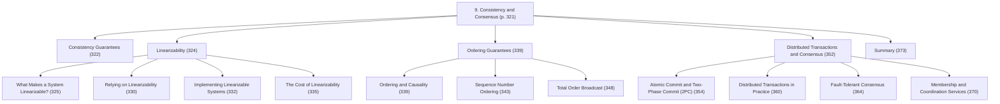
```mermaid
flowchart TB
    CH["9. Consistency and Consensus (p. 321)"] --> CG["Consistency Guarantees (322)"]
    CH --> LIN["Linearizability (324)"]
    LIN --> L1["What Makes a System Linearizable? (325)"]
    LIN --> L2["Relying on Linearizability (330)"]
    LIN --> L3["Implementing Linearizable Systems (332)"]
    LIN --> L4["The Cost of Linearizability (335)"]
    CH --> ORD["Ordering Guarantees (339)"]
    ORD --> O1["Ordering and Causality (339)"]
    ORD --> O2["Sequence Number Ordering (343)"]
    ORD --> O3["Total Order Broadcast (348)"]
    CH --> DTC["Distributed Transactions and Consensus (352)"]
    DTC --> D1["Atomic Commit and Two-Phase Commit (2PC) (354)"]
    DTC --> D2["Distributed Transactions in Practice (360)"]
    DTC --> D3["Fault-Tolerant Consensus (364)"]
    DTC --> D4["Membership and Coordination Services (370)"]
    CH --> SUM["Summary (373)"]
```

How the ideas connect (Kleppmann notes, Slides 101–141):

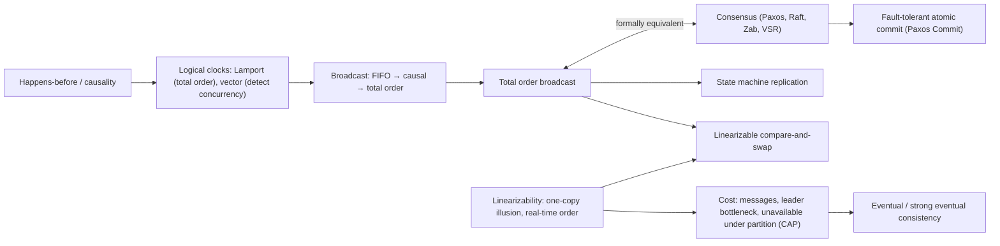
```mermaid
flowchart LR
    HB["Happens-before / causality"] --> LC["Logical clocks: Lamport (total order), vector (detect concurrency)"]
    LC --> BC["Broadcast: FIFO → causal → total order"]
    BC --> TOB["Total order broadcast"]
    TOB <-->|"formally equivalent"| CON["Consensus (Paxos, Raft, Zab, VSR)"]
    TOB --> SMR["State machine replication"]
    TOB --> CAS["Linearizable compare-and-swap"]
    CON --> FT2PC["Fault-tolerant atomic commit (Paxos Commit)"]
    LINR["Linearizability: one-copy illusion, real-time order"] --> CAS
    LINR --> COST["Cost: messages, leader bottleneck, unavailable under partition (CAP)"]
    COST --> EC["Eventual / strong eventual consistency"]
```

---

## 2. Consistency guarantees (p. 322)

Eventual consistency, and what is stronger and weaker (Kleppmann notes, Slide 140):

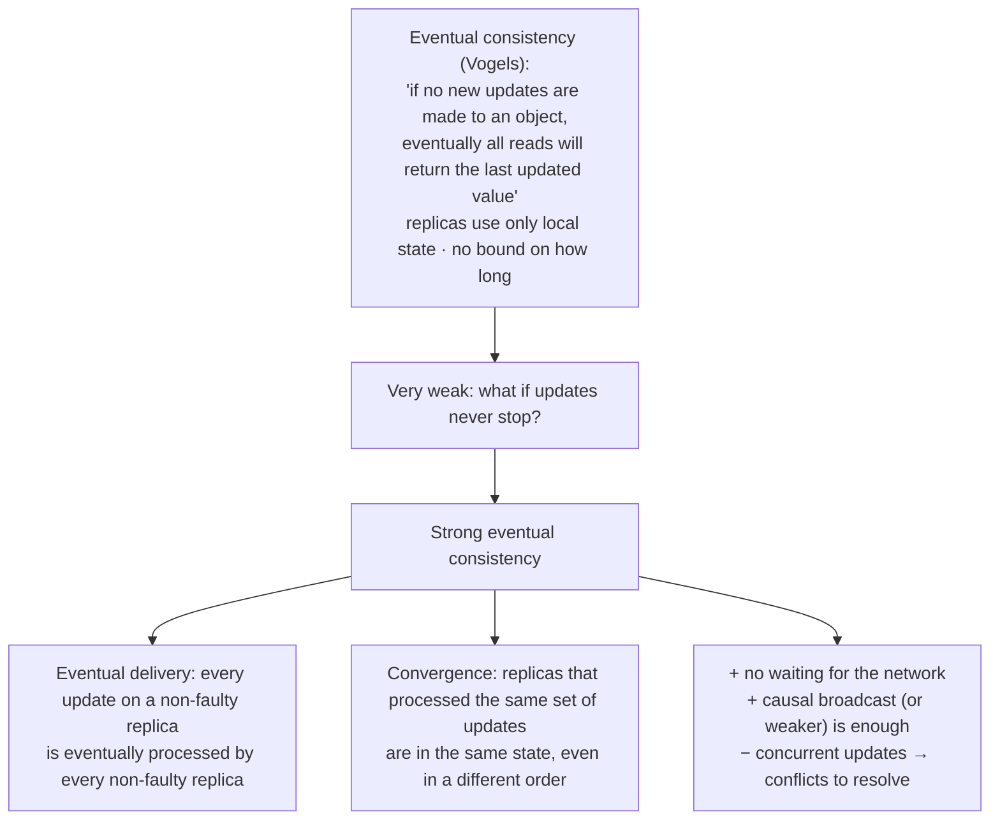
```mermaid
flowchart TB
    EC["Eventual consistency (Vogels):<br/>'if no new updates are made to an object,<br/>eventually all reads will return the last updated value'<br/>replicas use only local state · no bound on how long"] --> WEAK["Very weak: what if updates never stop?"]
    WEAK --> SEC["Strong eventual consistency"]
    SEC --> S1["Eventual delivery: every update on a non-faulty replica<br/>is eventually processed by every non-faulty replica"]
    SEC --> S2["Convergence: replicas that processed the same set of updates<br/>are in the same state, even in a different order"]
    SEC --> P["+ no waiting for the network<br/>+ causal broadcast (or weaker) is enough<br/>− concurrent updates → conflicts to resolve"]
```

The Jepsen map of consistency models (an arrow means "implies", so the stronger model is at the top):

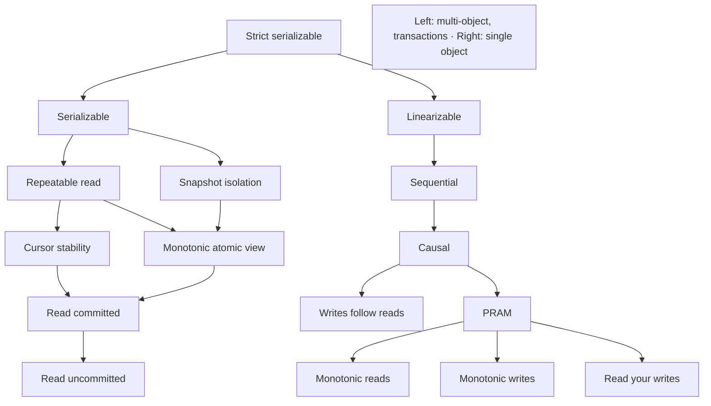
```mermaid
flowchart TB
    SS["Strict serializable"] --> SER["Serializable"]
    SS --> LIN["Linearizable"]
    SER --> RR["Repeatable read"]
    SER --> SI["Snapshot isolation"]
    RR --> MAV["Monotonic atomic view"]
    SI --> MAV
    RR --> CS["Cursor stability"]
    CS --> RC["Read committed"]
    MAV --> RC
    RC --> RU["Read uncommitted"]
    LIN --> SEQ["Sequential"]
    SEQ --> CAU["Causal"]
    CAU --> WFR["Writes follow reads"]
    CAU --> PRAM["PRAM"]
    PRAM --> MR["Monotonic reads"]
    PRAM --> MW["Monotonic writes"]
    PRAM --> RYW["Read your writes"]
    LEFT["Left: multi-object, transactions · Right: single object"]
```

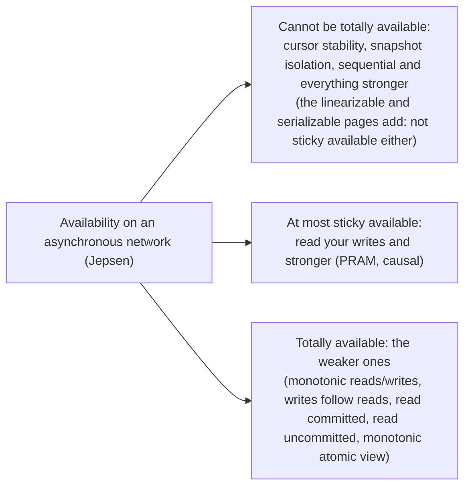
```mermaid
flowchart LR
    AV["Availability on an asynchronous network (Jepsen)"] --> U["Cannot be totally available:<br/>cursor stability, snapshot isolation, sequential and everything stronger<br/>(the linearizable and serializable pages add: not sticky available either)"]
    AV --> ST["At most sticky available:<br/>read your writes and stronger (PRAM, causal)"]
    AV --> TOT["Totally available: the weaker ones<br/>(monotonic reads/writes, writes follow reads, read committed, read uncommitted, monotonic atomic view)"]
```

---

## 3. Linearizability (p. 324)

### 3.1 What makes a system linearizable? (p. 325)

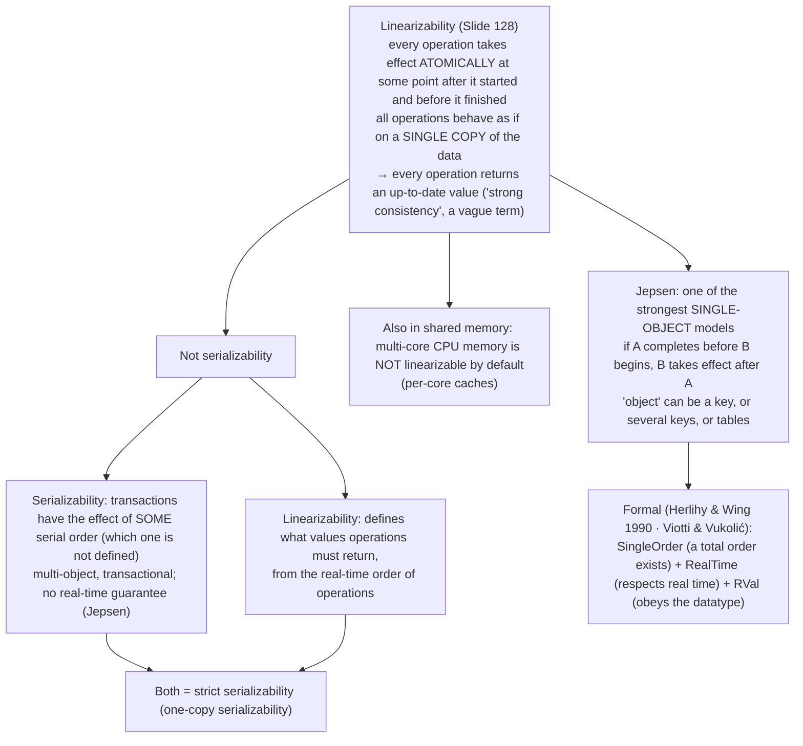
```mermaid
flowchart TB
    DEF["Linearizability (Slide 128)<br/>every operation takes effect ATOMICALLY at some point after it started and before it finished<br/>all operations behave as if on a SINGLE COPY of the data<br/>→ every operation returns an up-to-date value ('strong consistency', a vague term)"] --> J["Jepsen: one of the strongest SINGLE-OBJECT models<br/>if A completes before B begins, B takes effect after A<br/>'object' can be a key, or several keys, or tables"]
    DEF --> MC["Also in shared memory: multi-core CPU memory is NOT linearizable by default<br/>(per-core caches)"]
    DEF --> NS["Not serializability"]
    NS --> SERI["Serializability: transactions have the effect of SOME serial order (which one is not defined)<br/>multi-object, transactional; no real-time guarantee (Jepsen)"]
    NS --> LINI["Linearizability: defines what values operations must return,<br/>from the real-time order of operations"]
    SERI --> BOTH["Both = strict serializability (one-copy serializability)"]
    LINI --> BOTH
    J --> FORMAL["Formal (Herlihy & Wing 1990 · Viotti & Vukolić):<br/>SingleOrder (a total order exists) + RealTime (respects real time) + RVal (obeys the datatype)"]
```

Read-after-write revisited (Slide 129). Read-after-write only covers one node's own reads and writes; linearizability extends it to different nodes:

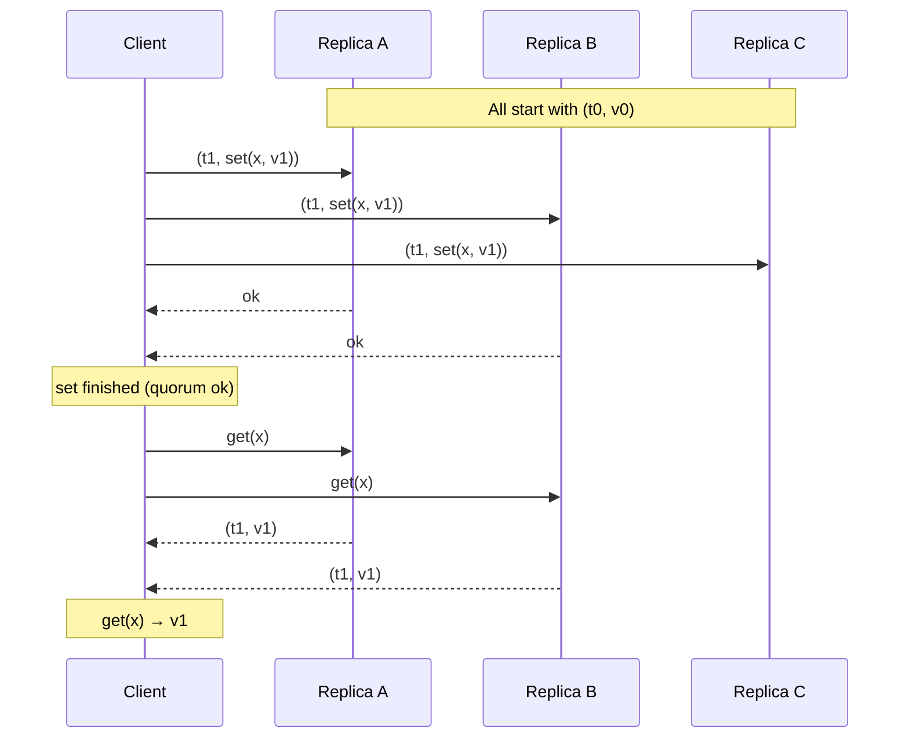
```mermaid
sequenceDiagram
    participant C as Client
    participant A as Replica A
    participant B as Replica B
    participant R as Replica C
    Note over A,R: All start with (t0, v0)
    C->>A: (t1, set(x, v1))
    C->>B: (t1, set(x, v1))
    C->>R: (t1, set(x, v1))
    A-->>C: ok
    B-->>C: ok
    Note over C: set finished (quorum ok)
    C->>A: get(x)
    C->>B: get(x)
    A-->>C: (t1, v1)
    B-->>C: (t1, v1)
    Note over C: get(x) → v1
```

From the client's point of view only (Slides 130, 131). Linearizability ignores the replicas and looks at when each operation starts and finishes in **real time**:

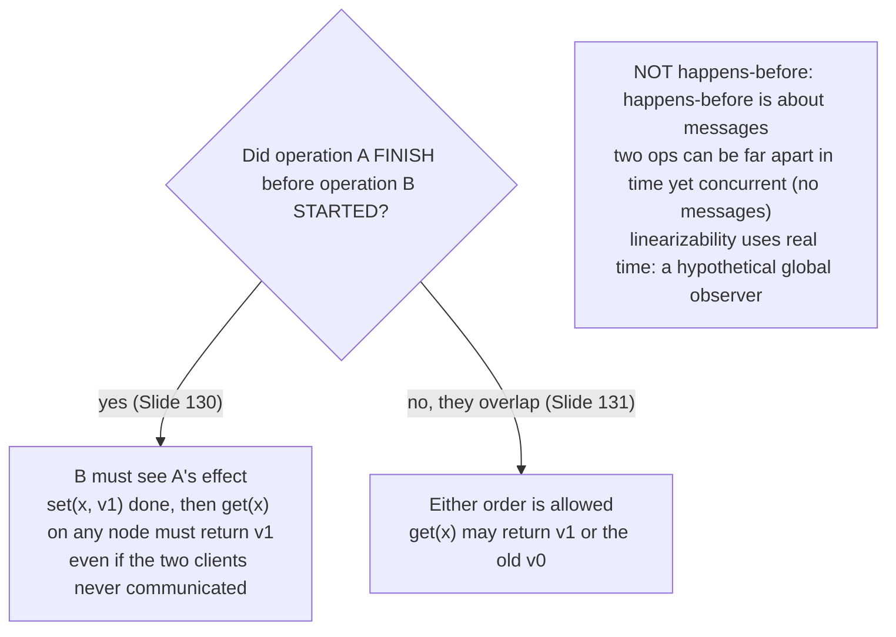
```mermaid
flowchart TB
    Q{"Did operation A FINISH before operation B STARTED?"}
    Q -->|"yes (Slide 130)"| Y["B must see A's effect<br/>set(x, v1) done, then get(x) on any node must return v1<br/>even if the two clients never communicated"]
    Q -->|"no, they overlap (Slide 131)"| N["Either order is allowed<br/>get(x) may return v1 or the old v0"]
    HBN["NOT happens-before: happens-before is about messages<br/>two ops can be far apart in time yet concurrent (no messages)<br/>linearizability uses real time: a hypothetical global observer"]
```

Not linearizable, even with quorum reads and writes (Slides 132, 133):

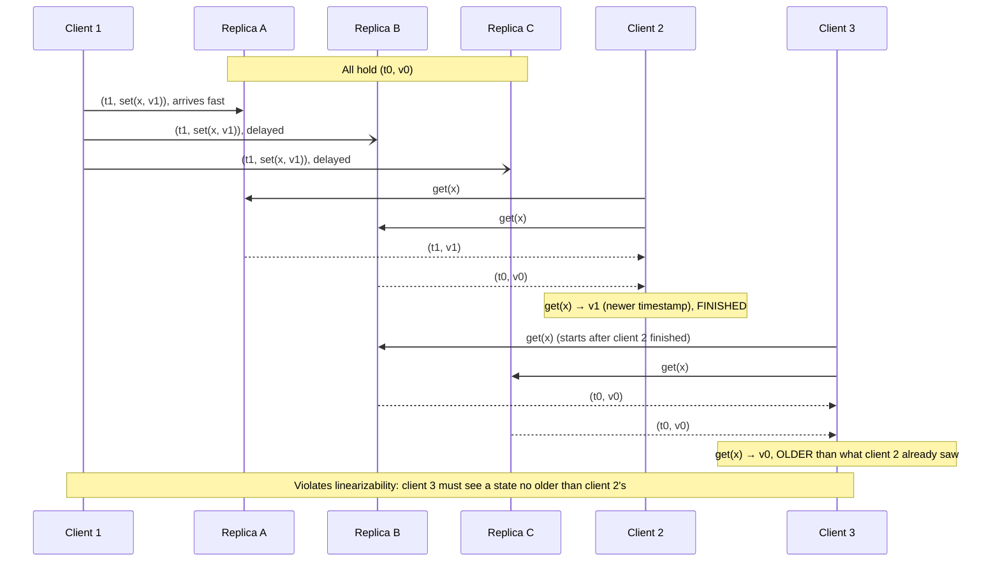
```mermaid
sequenceDiagram
    participant C1 as Client 1
    participant A as Replica A
    participant B as Replica B
    participant R as Replica C
    participant C2 as Client 2
    participant C3 as Client 3
    Note over A,R: All hold (t0, v0)
    C1->>A: (t1, set(x, v1)), arrives fast
    C1-)B: (t1, set(x, v1)), delayed
    C1-)R: (t1, set(x, v1)), delayed
    C2->>A: get(x)
    C2->>B: get(x)
    A-->>C2: (t1, v1)
    B-->>C2: (t0, v0)
    Note over C2: get(x) → v1 (newer timestamp), FINISHED
    C3->>B: get(x) (starts after client 2 finished)
    C3->>R: get(x)
    B-->>C3: (t0, v0)
    R-->>C3: (t0, v0)
    Note over C3: get(x) → v0, OLDER than what client 2 already saw
    Note over C1,C3: Violates linearizability: client 3 must see a state no older than client 2's
```

### 3.2 Relying on linearizability (p. 330)

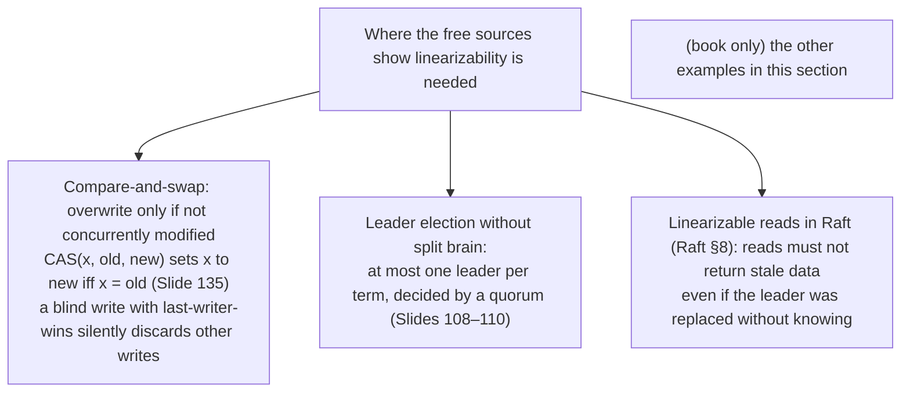
```mermaid
flowchart TB
    NEED["Where the free sources show linearizability is needed"] --> CASN["Compare-and-swap: overwrite only if not concurrently modified<br/>CAS(x, old, new) sets x to new iff x = old (Slide 135)<br/>a blind write with last-writer-wins silently discards other writes"]
    NEED --> LEAD["Leader election without split brain:<br/>at most one leader per term, decided by a quorum (Slides 108–110)"]
    NEED --> RAFTR["Linearizable reads in Raft (Raft §8): reads must not return stale data<br/>even if the leader was replaced without knowing"]
    BOOK["(book only) the other examples in this section"]
```

### 3.3 Implementing linearizable systems (p. 332)

ABD: making quorum reads and writes linearizable (Slide 134; Attiya, Bar-Noy, Dolev 1995):

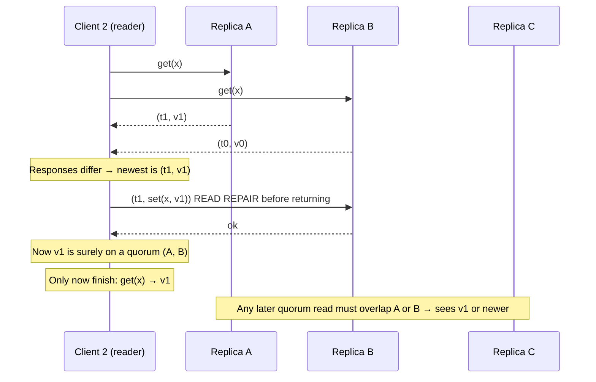
```mermaid
sequenceDiagram
    participant C2 as Client 2 (reader)
    participant A as Replica A
    participant B as Replica B
    participant R as Replica C
    C2->>A: get(x)
    C2->>B: get(x)
    A-->>C2: (t1, v1)
    B-->>C2: (t0, v0)
    Note over C2: Responses differ → newest is (t1, v1)
    C2->>B: (t1, set(x, v1)) READ REPAIR before returning
    B-->>C2: ok
    Note over C2: Now v1 is surely on a quorum (A, B)
    Note over C2: Only now finish: get(x) → v1
    Note over A,R: Any later quorum read must overlap A or B → sees v1 or newer
```

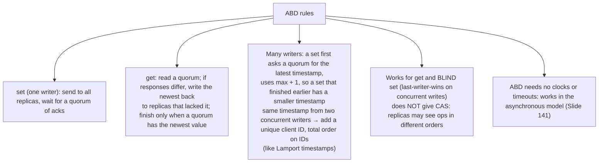
```mermaid
flowchart TB
    ABD["ABD rules"] --> W["set (one writer): send to all replicas, wait for a quorum of acks"]
    ABD --> R["get: read a quorum; if responses differ, write the newest back<br/>to replicas that lacked it; finish only when a quorum has the newest value"]
    ABD --> MW["Many writers: a set first asks a quorum for the latest timestamp,<br/>uses max + 1, so a set that finished earlier has a smaller timestamp<br/>same timestamp from two concurrent writers → add a unique client ID, total order on IDs<br/>(like Lamport timestamps)"]
    ABD --> LIM["Works for get and BLIND set (last-writer-wins on concurrent writes)<br/>does NOT give CAS: replicas may see ops in different orders"]
    ABD --> ASYNC["ABD needs no clocks or timeouts: works in the asynchronous model (Slide 141)"]
```

Linearizable CAS using total order broadcast (Slide 136):

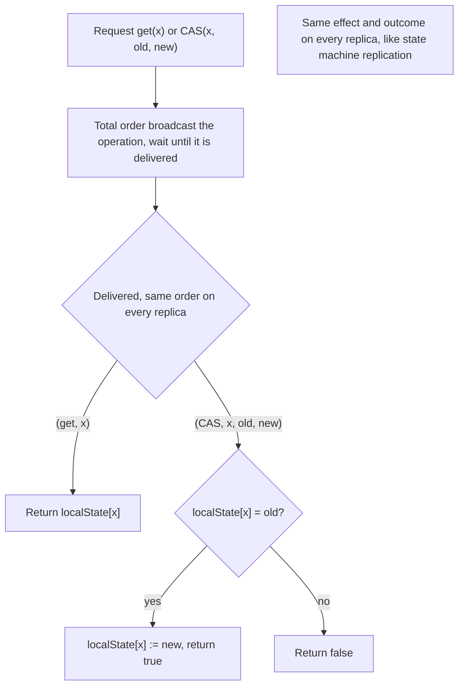
```mermaid
flowchart TB
    REQ["Request get(x) or CAS(x, old, new)"] --> TOB["Total order broadcast the operation, wait until it is delivered"]
    TOB --> DEL{"Delivered, same order on every replica"}
    DEL -->|"(get, x)"| G["Return localState[x]"]
    DEL -->|"(CAS, x, old, new)"| C{"localState[x] = old?"}
    C -->|yes| T["localState[x] := new, return true"]
    C -->|no| F["Return false"]
    NOTE["Same effect and outcome on every replica, like state machine replication"]
```

Linearizable reads in Raft (Raft §8):

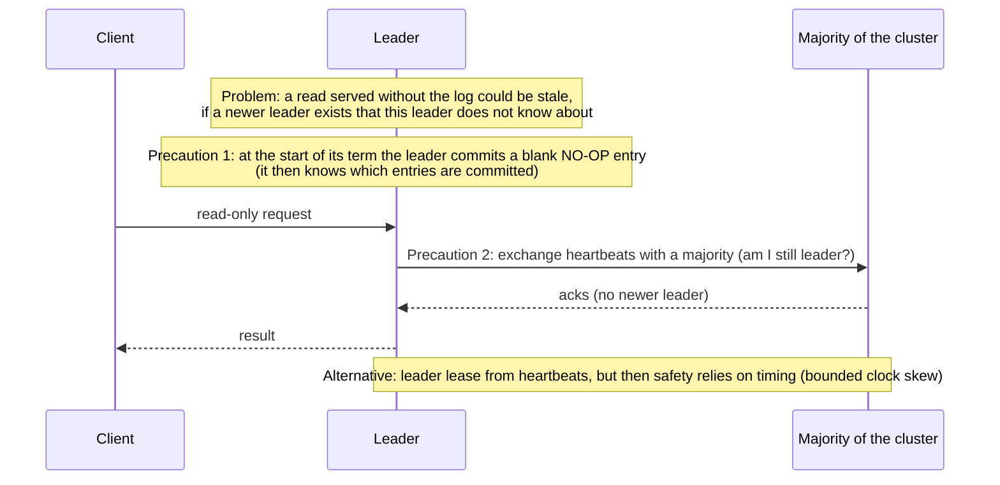
```mermaid
sequenceDiagram
    participant CL as Client
    participant L as Leader
    participant M as Majority of the cluster
    Note over L: Problem: a read served without the log could be stale,<br/>if a newer leader exists that this leader does not know about
    Note over L: Precaution 1: at the start of its term the leader commits a blank NO-OP entry<br/>(it then knows which entries are committed)
    CL->>L: read-only request
    L->>M: Precaution 2: exchange heartbeats with a majority (am I still leader?)
    M-->>L: acks (no newer leader)
    L-->>CL: result
    Note over L,M: Alternative: leader lease from heartbeats, but then safety relies on timing (bounded clock skew)
```

Duplicate commands in Raft (Raft §8): clients give each command a unique serial number, and the state machine remembers the last serial number per client and its response. If the leader crashes after committing but before replying, the retried command is answered without running it twice.

### 3.4 The cost of linearizability (p. 335)

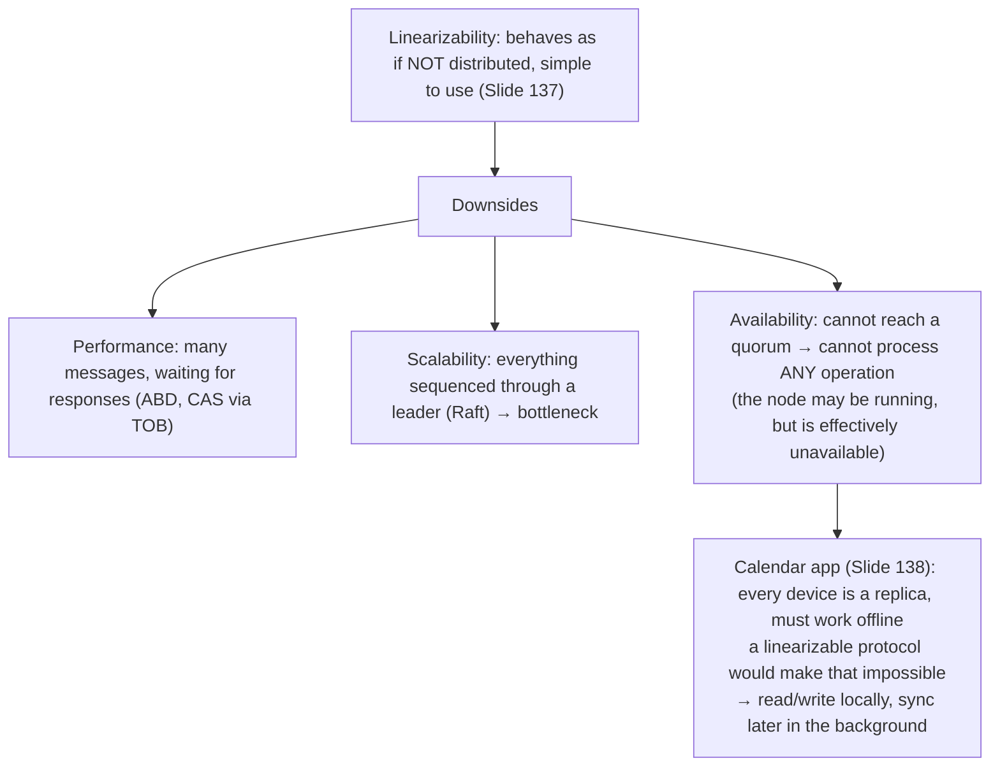
```mermaid
flowchart TB
    PRO["Linearizability: behaves as if NOT distributed, simple to use (Slide 137)"] --> CON["Downsides"]
    CON --> C1["Performance: many messages, waiting for responses (ABD, CAS via TOB)"]
    CON --> C2["Scalability: everything sequenced through a leader (Raft) → bottleneck"]
    CON --> C3["Availability: cannot reach a quorum → cannot process ANY operation<br/>(the node may be running, but is effectively unavailable)"]
    C3 --> CAL["Calendar app (Slide 138): every device is a replica, must work offline<br/>a linearizable protocol would make that impossible<br/>→ read/write locally, sync later in the background"]
```

The CAP theorem (Slide 139; Gilbert and Lynch 2002):

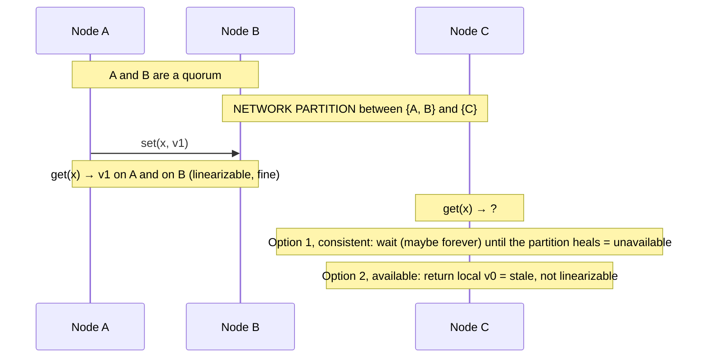
```mermaid
sequenceDiagram
    participant A as Node A
    participant B as Node B
    participant C as Node C
    Note over A,B: A and B are a quorum
    Note over B,C: NETWORK PARTITION between {A, B} and {C}
    A->>B: set(x, v1)
    Note over A,B: get(x) → v1 on A and on B (linearizable, fine)
    Note over C: get(x) → ?
    Note over C: Option 1, consistent: wait (maybe forever) until the partition heals = unavailable
    Note over C: Option 2, available: return local v0 = stale, not linearizable
```

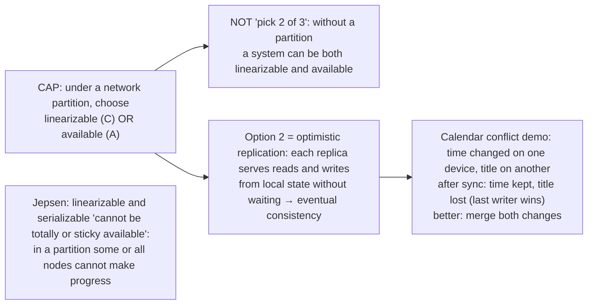
```mermaid
flowchart LR
    CAP["CAP: under a network partition, choose<br/>linearizable (C) OR available (A)"] --> NOT["NOT 'pick 2 of 3': without a partition<br/>a system can be both linearizable and available"]
    CAP --> OPT["Option 2 = optimistic replication: each replica serves reads and writes<br/>from local state without waiting → eventual consistency"]
    OPT --> CONF["Calendar conflict demo: time changed on one device, title on another<br/>after sync: time kept, title lost (last writer wins)<br/>better: merge both changes"]
    JEP["Jepsen: linearizable and serializable 'cannot be totally or sticky available':<br/>in a partition some or all nodes cannot make progress"]
```

---

## 4. Ordering guarantees (p. 339)

### 4.1 Ordering and causality (p. 339)

Why order matters (Slide 60): network links may reorder messages.

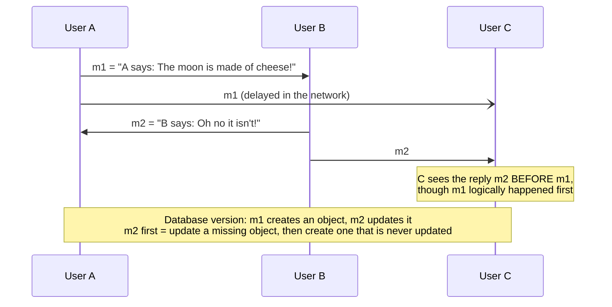
```mermaid
sequenceDiagram
    participant A as User A
    participant B as User B
    participant C as User C
    A->>B: m1 = "A says: The moon is made of cheese!"
    A-)C: m1 (delayed in the network)
    B->>A: m2 = "B says: Oh no it isn't!"
    B->>C: m2
    Note over C: C sees the reply m2 BEFORE m1,<br/>though m1 logically happened first
    Note over A,C: Database version: m1 creates an object, m2 updates it<br/>m2 first = update a missing object, then create one that is never updated
```

Physical timestamps are inconsistent with causality (Slide 61):

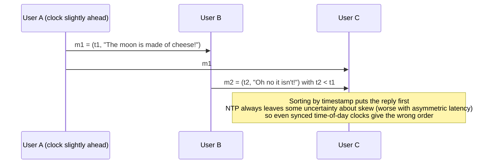
```mermaid
sequenceDiagram
    participant A as User A (clock slightly ahead)
    participant B as User B
    participant C as User C
    A->>B: m1 = (t1, "The moon is made of cheese!")
    A->>C: m1
    B->>C: m2 = (t2, "Oh no it isn't!") with t2 < t1
    Note over C: Sorting by timestamp puts the reply first<br/>NTP always leaves some uncertainty about skew (worse with asymmetric latency)<br/>so even synced time-of-day clocks give the wrong order
```

The happens-before relation (Slides 62–64):

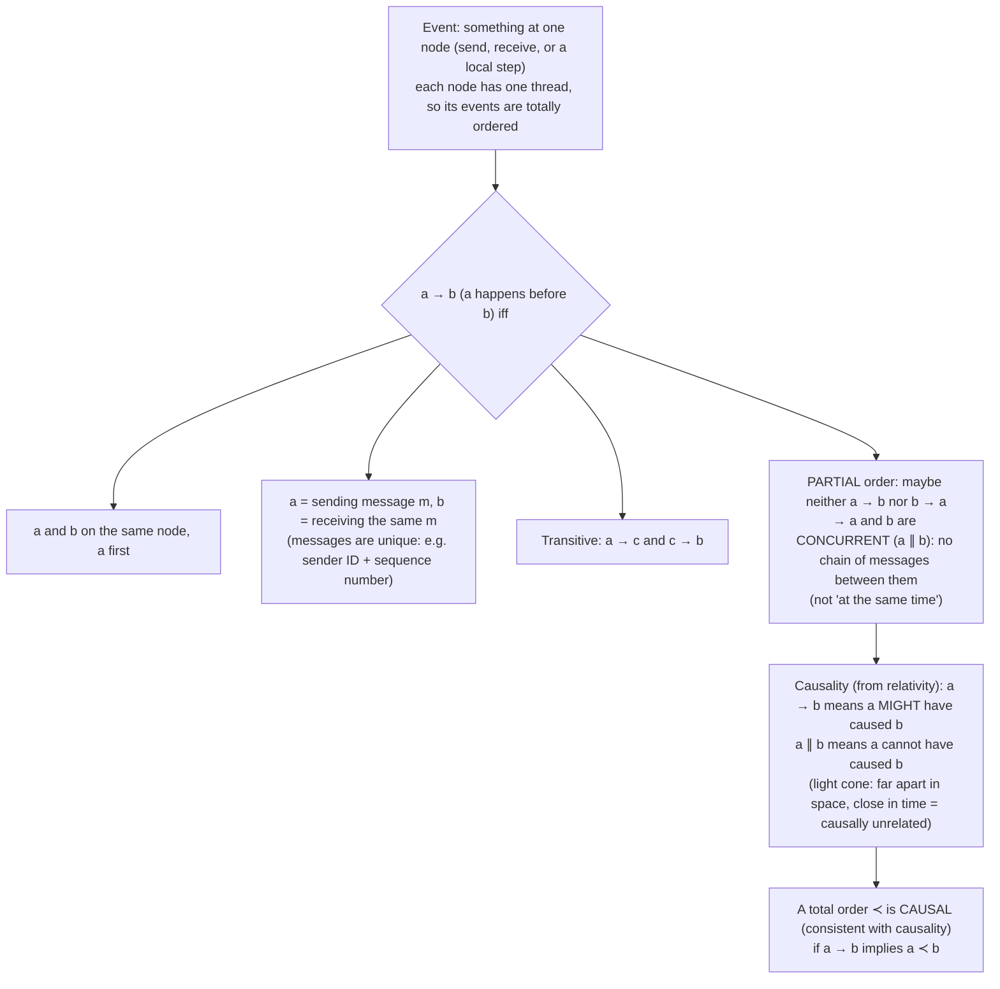
```mermaid
flowchart TB
    EV["Event: something at one node (send, receive, or a local step)<br/>each node has one thread, so its events are totally ordered"] --> HB{"a → b (a happens before b) iff"}
    HB --> R1["a and b on the same node, a first"]
    HB --> R2["a = sending message m, b = receiving the same m<br/>(messages are unique: e.g. sender ID + sequence number)"]
    HB --> R3["Transitive: a → c and c → b"]
    HB --> PO["PARTIAL order: maybe neither a → b nor b → a<br/>→ a and b are CONCURRENT (a ∥ b): no chain of messages between them<br/>(not 'at the same time')"]
    PO --> CAUS["Causality (from relativity): a → b means a MIGHT have caused b<br/>a ∥ b means a cannot have caused b<br/>(light cone: far apart in space, close in time = causally unrelated)"]
    CAUS --> CO["A total order ≺ is CAUSAL (consistent with causality)<br/>if a → b implies a ≺ b"]
```

The worked example on Slide 63, as a timeline:

```mermaid
sequenceDiagram
    participant A as Node A
    participant B as Node B
    participant C as Node C
    Note over A: event a
    Note over A: event b = send m1
    A->>B: m1
    Note over B: event c = receive m1
    Note over B: event d = send m2
    Note over C: event e
    B->>C: m2
    Note over C: event f = receive m2
    Note over A,C: a → b, c → d, e → f (node order) · b → c, d → f (messages)<br/>a → c, a → d, a → f, b → d, b → f, c → f (transitivity)<br/>a ∥ e, b ∥ e, c ∥ e, d ∥ e
```

### 4.2 Sequence number ordering (p. 343)

Logical clocks count events, not seconds, and are built to capture causality: if e1 → e2 then T(e1) < T(e2) (Slide 65).

```mermaid
flowchart TB
    LAM["Lamport clock (Lamport 1978, Slides 66–67)"] --> L1["Each node: counter t := 0"]
    L1 --> L2["Any local event: t := t + 1"]
    L2 --> L3["Send m: t := t + 1, send (t, m)"]
    L3 --> L4["Receive (t', m): t := max(t, t') + 1, then deliver"]
    L4 --> LP["Properties<br/>a → b ⇒ L(a) < L(b)<br/>but L(a) < L(b) does NOT mean a → b (could be a ∥ b)<br/>L(a) = L(b) possible for different events<br/>crash-stop, or crash-recovery if t is on disk"]
    LP --> TO["Total order: compare (L(e), node N(e)) pairs lexicographically<br/>a ≺ b iff L(a) < L(b), or equal L and N(a) < N(b)<br/>this order is causal; concurrent events get an arbitrary order"]
```

Lamport clocks example (Slide 68):

```mermaid
sequenceDiagram
    participant A as Node A
    participant B as Node B
    participant C as Node C
    Note over A: (1, A)
    Note over C: (1, C)
    Note over A: (2, A) send m1
    A->>B: (2, m1)
    Note over B: (3, B) = max(0, 2) + 1
    Note over A: (3, A) same number as (3, B), different node
    Note over B: (4, B) send m2
    B->>C: (4, m2)
    Note over C: (5, C) = max(1, 4) + 1
```

Vector clocks: detect concurrency (Slides 69–72):

```mermaid
flowchart TB
    WHY["Lamport L(a) < L(b) cannot tell a → b from a ∥ b"] --> VC["Vector clock: one counter per node, T = ⟨t1 ... tn⟩<br/>ti = number of events observed from node Ni"]
    VC --> V1["Event at Ni: T[i] += 1"]
    VC --> V2["Send: T[i] += 1, attach T"]
    VC --> V3["Receive T': T[j] := max(T[j], T'[j]) for every j, then T[i] += 1"]
    VC --> ORD["Order: T ≤ T' iff every T[i] ≤ T'[i] · T < T' iff ≤ and not equal<br/>T ∥ T' iff neither ≤ the other"]
    ORD --> PROP["V(a) < V(b) ⇔ a → b · V(a) = V(b) ⇔ a = b · V(a) ∥ V(b) ⇔ a ∥ b<br/>a vector = the event plus all its causal dependencies"]
    PROP --> EX["Example (Slide 71, nodes A, B, C): ⟨2,2,0⟩ = first two events of A and of B, none of C<br/>⟨2,2,0⟩ vs ⟨0,0,1⟩: incomparable → concurrent"]
    VC --> HYB["Also: hybrid clocks mix logical and physical (Kulkarni et al. 2014)"]
```

### 4.3 Total order broadcast (p. 348)

Broadcast vocabulary (Slides 73–74): the application *broadcasts*, the algorithm *sends* and *receives* over point-to-point links, then *delivers* to the application, possibly after buffering.

```mermaid
flowchart TB
    BE["Best-effort broadcast (may drop)"] --> REL["Reliable broadcast: every non-faulty node eventually delivers every message"]
    REL --> FIFO["FIFO broadcast: same sender → delivered in send order"]
    FIFO --> CB["Causal broadcast: broadcast(m1) → broadcast(m2) ⇒ m1 delivered first everywhere"]
    REL --> TOBC["Total order broadcast (atomic broadcast): SAME delivery order on all nodes,<br/>including a node's delivery to itself"]
    CB --> FTO["FIFO-total order broadcast = FIFO + total order (strongest)"]
    TOBC --> FTO
```

The three orders side by side (Slides 76–79). A broadcaster always delivers its own message to itself too.

```mermaid
sequenceDiagram
    participant A as Node A
    participant B as Node B
    participant C as Node C
    Note over A,C: FIFO (Slide 76): A broadcasts m1 then m3, B broadcasts m2 after delivering m1
    A->>B: m1
    A-)C: m1 (slow)
    B->>C: m2
    Note over C: Delivers m2 before m1: valid FIFO, but violates causality
    Note over A,C: CAUSAL fixes it: C must HOLD BACK m2 until m1 is delivered
    Note over A,C: Causal (Slide 77): m2 and m3 are concurrent, so (m1, m2, m3) and (m1, m3, m2) are both valid
    Note over A,C: TOTAL ORDER (Slides 78, 79): all nodes use ONE order, e.g. m1, m2, m3 everywhere,<br/>so A's own delivery of m3 waits until it has received m2 from B
```

Broadcast algorithms (Slides 81–86):

```mermaid
flowchart TB
    L1["Layer 1: make it reliable"] --> NAIVE["Sender sends to every node over reliable links (retry + dedupe)<br/>− sender can crash before all copies arrive"]
    NAIVE --> EAGER["Eager reliable broadcast: on FIRST receipt, re-broadcast to everyone<br/>+ survives crashes · − up to O(n²) messages"]
    EAGER --> GOS["Gossip / epidemic: on first receipt, forward to 3 random nodes<br/>reaches all with high probability, resilient and efficient"]
    L2["Layer 2: enforce order on top"] --> FA["FIFO: tag (sender i, sendSeq); deliver a sender's next seq only<br/>state: sendSeq, delivered[] per sender, buffer"]
    L2 --> CA["Causal: tag deps = copy of delivered[], with deps[i] = sendSeq<br/>deliver when deps ≤ delivered (vector compare)<br/>vector counts DELIVERED messages, not events"]
    L2 --> TA["Total order, two simple ways, both NOT fault tolerant:"]
    TA --> SLA["Single leader (sequencer): send to leader, it FIFO-broadcasts<br/>− leader crash stops delivery, changing leader safely is hard"]
    TA --> LCA["Lamport timestamps: deliver in timestamp order<br/>− how do you know you saw everything below T?<br/>need FIFO links and a message ≥ T from EVERY node"]
```

What total order broadcast is used for (Slides 101–104, 106):

```mermaid
flowchart TB
    TOB["(FIFO-)total order broadcast"] --> SMR["State machine replication (Slides 101–102)<br/>broadcast every update; each replica applies it on delivery<br/>logic must be DETERMINISTIC (errors too), can be arbitrarily complex<br/>= active replication · blockchains, ledgers, smart contracts<br/>− cannot update immediately: wait for own delivery<br/>− needs FAULT-TOLERANT total order broadcast"]
    TOB --> PB["Passive / primary-backup replication (Slide 103)<br/>leader runs txns concurrently but COMMITS in a total order<br/>followers apply the log in commit order<br/>= total order broadcast of commit records"]
    TOB --> CASL["Linearizable CAS (Slide 136)"]
    TOB <-->|"equivalent (Chandra & Toueg 1996)"| CON["Consensus (Slide 106)<br/>TOB → consensus: first delivered proposal is the decision<br/>consensus → TOB: one consensus instance per slot: 1st, 2nd, 3rd message..."]
    WEAKER["Weaker broadcast for replication (Slide 104)"] --> W1["total order → deterministic updates (SMR)"]
    WEAKER --> W2["causal → deterministic, concurrent updates commute"]
    WEAKER --> W3["reliable → deterministic, ALL updates commute"]
    WEAKER --> W4["best-effort → deterministic, commutative, idempotent, tolerates loss"]
    W2 --> COMM["f and g commute if f(g(x)) = g(f(x))"]
```

---

## 5. Distributed transactions and consensus (p. 352)

Why consensus (Slides 105–106): with a single leader, failover by a human works for planned maintenance, but for a sudden crash it takes minutes. Consensus moves leadership automatically.

```mermaid
flowchart TB
    CONS["Consensus: several nodes agree on a value"] --> P1["One or more nodes PROPOSE values"]
    P1 --> P2["The decided value is one of the proposed values"]
    P2 --> P3["All non-faulty nodes decide the SAME value"]
    P3 --> P4["The decision is FINAL"]
    ALG["Algorithms (Slide 106)"] --> PAX["Paxos: single value · Multi-Paxos: total order broadcast"]
    ALG --> RVZ["Raft, Viewstamped Replication, Zab: FIFO-total order broadcast by default"]
```

### 5.1 Atomic commit and two-phase commit (2PC) (p. 354)

```mermaid
flowchart LR
    AC["Atomic commit (Slides 122–123)<br/>txn on many nodes: ALL commit or ALL abort<br/>any node crashes → all abort"] --- VS["vs"]
    VS --- CN["Consensus"]
    AC --> A1["EVERY node votes commit/abort"]
    AC --> A2["Must commit if all vote commit; must abort if ≥ 1 votes abort"]
    AC --> A3["Must abort if a participant crashes"]
    CN --> C1["One or more nodes propose"]
    CN --> C2["ANY proposed value can be decided"]
    CN --> C3["Crashes tolerated while a quorum works"]
```

The 2PC flow (Slide 124; Gray 1978):

```mermaid
sequenceDiagram
    participant CL as Client
    participant CO as Coordinator
    participant A as Replica A
    participant B as Replica B
    CL->>A: begin T1 (normal single-node txn)
    CL->>B: begin T1
    Note over CL,B: ... usual reads and writes ...
    CL->>CO: commit T1
    CO->>A: PREPARE (phase 1)
    CO->>B: PREPARE
    Note over A,B: Before saying ok: write all updates to disk, check constraints,<br/>KEEP holding the locks, promise to commit if told to
    A-->>CO: ok
    B-->>CO: ok
    Note over CO: Decide: all ok → commit · any abort or timeout → abort
    CO->>A: COMMIT (phase 2)
    CO->>B: COMMIT
```

What if the coordinator crashes? (Slide 125)

```mermaid
flowchart TB
    CR["Coordinator crashes"] --> D1["It writes its decision to disk; on recovery it reads it and sends it<br/>(or aborts if no decision was made)"]
    CR --> D2{"Crash AFTER prepare, BEFORE sending the decision?"}
    D2 -->|yes| IND["Participants that said ok are IN DOUBT<br/>cannot commit or abort alone (could break atomicity)"]
    IND --> BLK["Blocked until the coordinator recovers<br/>→ coordinator = single point of failure"]
    NOTE["2PC ≠ 2PL (two-phase locking gives serializable isolation)<br/>3PC exists but assumes an unrealistic synchronous model"]
```

### 5.2 Distributed transactions in practice (p. 360)

Fault-tolerant 2PC based on Paxos Commit (Slides 126–127; Gray and Lamport 2006). The coordinator stops being a single point of failure:

```mermaid
flowchart TB
    S["Commit requested for T with participants R"] --> PR["Send (Prepare, T, R) to each participant"]
    PR --> VOTE["Each participant total-order-broadcasts (Vote, T, myId, ok)"]
    SUS["A node suspects participant P crashed (timeout)"] --> VAB["It broadcasts (Vote, T, P, false) ON P's BEHALF<br/>race with P's own vote is fine:"]
    VOTE --> DLV["On delivering a vote (same order everywhere):<br/>count only the FIRST vote per participant"]
    VAB --> DLV
    DLV --> Q{"First vote from someone is abort?"}
    Q -->|yes| AB["Abort T at this node"]
    Q -->|no| ALL{"First votes from ALL participants are commit?"}
    ALL -->|yes| CM["Commit T at this node"]
    ALL -->|"not yet"| WAIT["Keep waiting"]
    NOTE["Every node decides the same, thanks to total order broadcast → atomicity kept"]
    BOOK["(book only) how distributed transactions are run in practice (rest of this section)"]
```

### 5.3 Fault-tolerant consensus (p. 364)

System models (Slide 107):

```mermaid
flowchart TB
    SM["Paxos, Raft...: fair-loss links, crash-recovery nodes, PARTIAL synchrony"] --> FLP["FLP (Fischer, Lynch, Paterson 1985): no DETERMINISTIC consensus algorithm<br/>is guaranteed to terminate in an asynchronous crash-stop model"]
    FLP --> WHY["Consensus needs a failure detector → a clock for timeouts"]
    WHY --> SAFE["Clocks only for timeouts: SAFETY (same messages, same order)<br/>never depends on timing · only LIVENESS (eventually delivered) does"]
    FLP --> RAND["Way around FLP: randomized algorithms (most systems use timeouts instead)"]
    SM --> BYZ["Byzantine variants exist (blockchains): much more complex, less efficient"]
```

Leader election: at most one leader per term (Slide 108):

```mermaid
flowchart TB
    FD["Failure detector: timeout → leader suspected dead → elect a new one"] --> TERM["Term number +1 at every election start"]
    TERM --> ONE["A node votes at most ONCE per term"]
    ONE --> QU["A candidate needs a QUORUM of votes"]
    QU --> EX["Slide example, 5 nodes A–E: one side elects a leader with a quorum that includes C<br/>the other side cannot elect a different leader in that term: C already voted<br/>(any two quorums overlap in at least one node)"]
    QU --> MAJ["Majority quorum: works while a majority (2 of 3, 3 of 5) is up and connected"]
```

Two leaders from different terms can still exist (Slide 109):

```mermaid
sequenceDiagram
    participant N1 as Node 1 (leader, term t)
    participant N2 as Node 2
    participant N3 as Node 3
    N1--xN2: network partition
    N1--xN3: network partition
    Note over N2,N3: Timeout: suspect node 1 (may be wrong: just a latency spike)
    N2->>N3: Vote for me in term t+1?
    N3-->>N2: yes
    Note over N2: Leader in term t+1
    Note over N1: Still thinks it is leader in term t, does not know about term t+1
    Note over N1,N3: Unique leader PER TERM, but not unique overall
```

So every decision needs a quorum again (Slide 110):

```mermaid
sequenceDiagram
    participant L as Leader
    participant F1 as Follower 1
    participant F2 as Follower 2
    L->>F1: Shall I be your leader in term t?
    L->>F2: Shall I be your leader in term t?
    F1-->>L: yes
    F2-->>L: yes
    L->>F1: Can we deliver message m next in term t?
    L->>F2: Can we deliver message m next in term t?
    F1-->>L: okay (I know no leader with a later term)
    F2-->>L: okay
    L->>F1: Right, now deliver m please
    L->>F2: Right, now deliver m please
    Note over L,F2: If a newer leader exists, at least one node in the 2nd quorum voted for it<br/>→ the old leader finds out and cannot decide anything more: SAFE
```

Raft's timing requirement (Raft §5.6):

```mermaid
flowchart LR
    T["broadcastTime ≪ electionTimeout ≪ MTBF"] --> B["broadcastTime: send RPCs to all + get replies<br/>0.5–20 ms (persisting to stable storage)"]
    T --> E["electionTimeout: chosen by you, 10–500 ms<br/>≫ broadcast so heartbeats keep followers quiet; random → few split votes"]
    T --> M["MTBF: mean time between failures of one server, months<br/>leader crash ≈ unavailable for one election timeout"]
    SAF["Safety must never depend on timing; availability always will"]
```

### 5.4 Membership and coordination services (p. 370)

From the free sources: changing the set of servers safely (Raft §6, joint consensus).

```mermaid
sequenceDiagram
    participant L as Leader
    participant OLD as Majority of C_old
    participant NEW as Majority of C_new
    Note over L,NEW: Switching straight from C_old to C_new is unsafe:<br/>two separate majorities could elect two leaders in one term
    Note over L: 0. New servers first join as NON-VOTING members until caught up
    L->>OLD: log entry C_old,new (joint consensus)
    L->>NEW: log entry C_old,new
    Note over L,NEW: A server uses the latest config in its log, committed or not<br/>during joint consensus: entries go to both configs, any server can lead,<br/>agreement needs separate majorities of BOTH
    OLD-->>L: ack
    NEW-->>L: ack
    Note over L: C_old,new committed
    L->>NEW: log entry C_new
    NEW-->>L: ack
    Note over L: C_new committed: servers not in C_new can shut down<br/>if the leader is not in C_new, it steps down now
    Note over L,NEW: Removed servers could disrupt with higher terms →<br/>ignore RequestVote within the minimum election timeout of hearing a leader
```

```mermaid
flowchart TB
    FREE["Other facts from the free sources"] --> SNAP["Raft §7: snapshotting (used in Chubby and ZooKeeper)<br/>each server snapshots its committed state independently<br/>keeps last included index + term (+ latest config)<br/>InstallSnapshot RPC for followers that are too far behind"]
    FREE --> REFS["The chapter cites: Chubby lock service, ZooKeeper, etcd, Apache Curator, Zab, Raft<br/>(official reference list, section 7)"]
    BOOK["(book only) how the book uses these services (the rest of this section)"]
```

---

## 6. Summary (p. 373)

Minimum system-model requirements, strongest assumptions first (Slide 141):

```mermaid
flowchart TB
    AC["Atomic commit<br/>waits for: ALL participating nodes · needs: partial synchrony"] --> CON["Consensus, total order broadcast, linearizable CAS<br/>waits for: a QUORUM · needs: partial synchrony<br/>(linearizable CAS ≡ consensus, Herlihy 1991)"]
    CON --> LGS["Linearizable get/set (ABD)<br/>waits for: a quorum · works: asynchronous (no clocks)"]
    LGS --> EV["Eventual consistency, causal broadcast, FIFO broadcast<br/>waits for: local replica only · works: asynchronous"]
```

One-page recap:

```mermaid
flowchart LR
    A["Linearizable = one copy + real-time order<br/>≠ serializable · both = strict serializable"] --> B["Quorums alone are not linearizable → ABD read repair before returning"]
    B --> C["CAS and leader election need total order broadcast = consensus"]
    C --> D["Consensus: terms, one vote per term, quorums, re-check every decision<br/>safety without timing, liveness with timeouts (FLP)"]
    D --> E["2PC: all vote, coordinator decides, blocks if it dies in doubt<br/>fix: votes via total order broadcast (Paxos Commit)"]
    A --> F["Cost: latency, leader bottleneck, no availability in a partition (CAP)<br/>→ eventual / strong eventual consistency"]
    G["Ordering: happens-before (partial) → Lamport (causal total order) → vector clocks (detect ∥)"] --> C
```

---

## 7. What the chapter cites

The book's official ch. 9 reference list, grouped by topic (titles only, so you know what the chapter builds on):

```mermaid
flowchart TB
    R["Ch. 9 references (110)"] --> LIN["Linearizability: Herlihy & Wing 1990 · Bailis 'Linearizability versus Serializability'<br/>Kingsbury: Knossos, MongoDB stale reads · Attiya, Bar-Noy, Dolev 1995 (ABD)"]
    R --> CAP["CAP: Gilbert & Lynch 2002 and 2012 · Brewer 'CAP Twelve Years Later'<br/>Kleppmann 'Please Stop Calling Databases CP or AP' and 'A Critique of the CAP Theorem'"]
    R --> ORD["Ordering: Lamport 1978 'Time, Clocks...' · Défago et al. total order broadcast survey<br/>causal consistency (Ahamad et al., Lloyd et al., Bailis 'Bolt-on')"]
    R --> TXN["Transactions: Gray 'The Transaction Concept' · XA specification · Sagas<br/>Skeen 'Nonblocking Commit Protocols' · Gray & Lamport 'Consensus on Transaction Commit'<br/>Helland 'Life Beyond Distributed Transactions' · SQL Server in-doubt xact resolution"]
    R --> CONS["Consensus: FLP 1985 · Chandra & Toueg 1996 · Dwork, Lynch, Stockmeyer 1988<br/>Paxos (Part-Time Parliament, Made Simple, Made Live) · Raft paper + Ongaro thesis<br/>Viewstamped Replication · Zab · Flexible Paxos · PBFT"]
    R --> COORD["Coordination: Chubby · ZooKeeper · etcd · Apache Curator · Kingsbury 'etcd and Consul'"]
```
